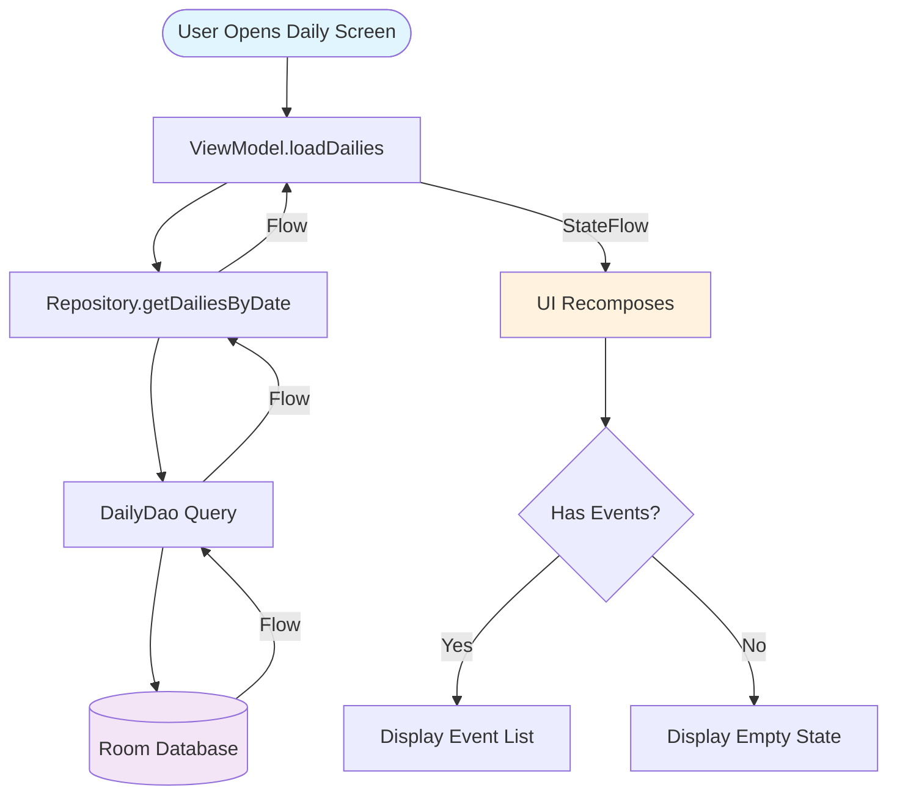
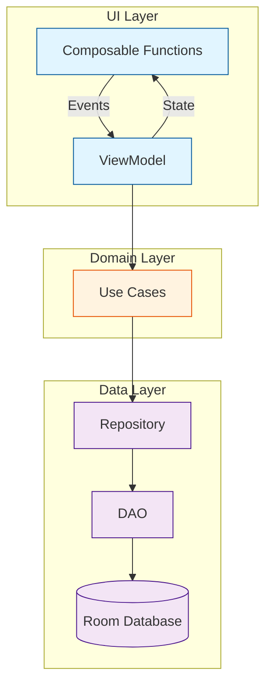
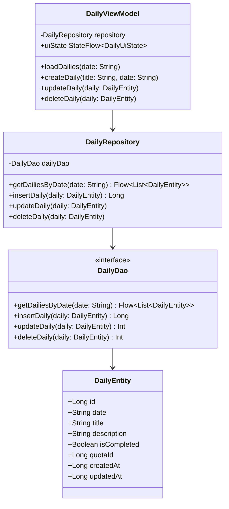
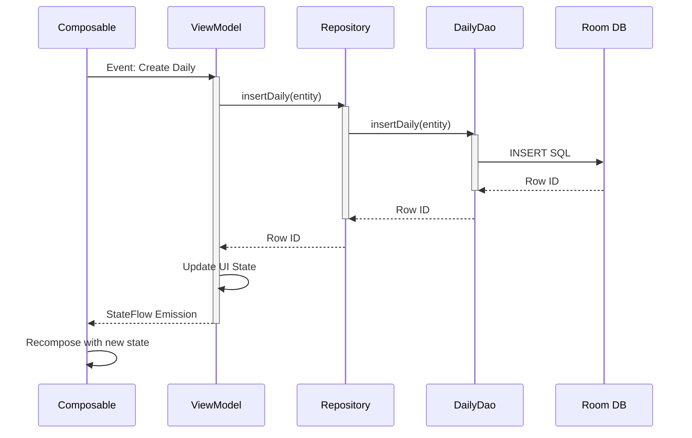
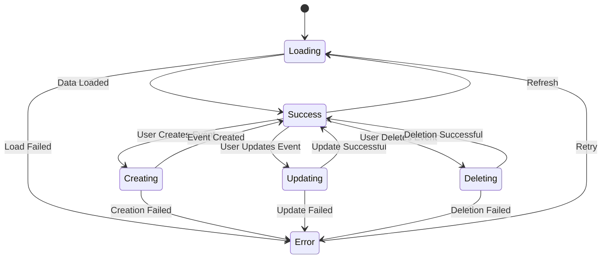
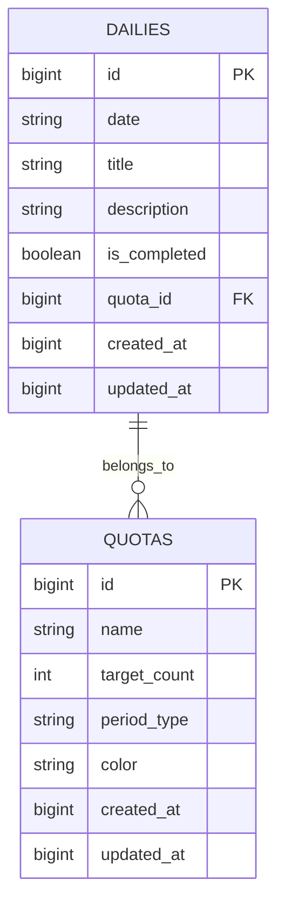
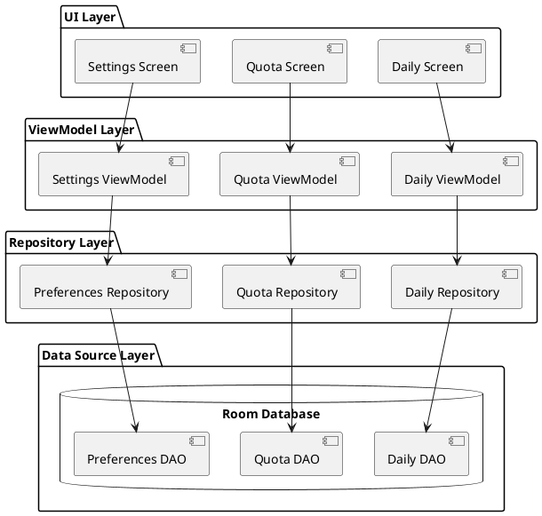
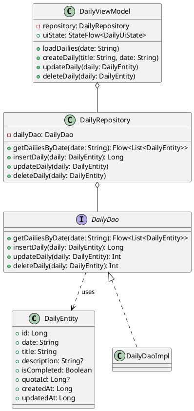
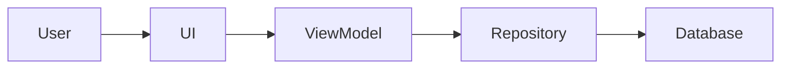

# Android Documentation Best Practices Guide

**Version:** 1.0
**Last Updated:** 2025-11-10
**Target:** Android applications with Kotlin, Jetpack Compose, Room Database, and MVVM/Clean Architecture

---

## Table of Contents

1. [Android Documentation Standards](#1-android-documentation-standards)
2. [KDoc Standards for Kotlin Code](#2-kdoc-standards-for-kotlin-code)
3. [Jetpack Compose Documentation](#3-jetpack-compose-documentation)
4. [Room Database Documentation](#4-room-database-documentation)
5. [Architecture Documentation](#5-architecture-documentation)
6. [Technical Writing Best Practices](#6-technical-writing-best-practices)
7. [Documentation Tools & Generators](#7-documentation-tools--generators)
8. [Diagram Tools](#8-diagram-tools)
9. [Project README Template](#9-project-readme-template)
10. [Common Pitfalls to Avoid](#10-common-pitfalls-to-avoid)

---

## 1. Android Documentation Standards

### Official Resources

- **Kotlin Style Guide:** https://developer.android.com/kotlin/style-guide
- **AndroidX KDoc Guidelines:** https://cs.android.com/androidx/platform/frameworks/support/+/androidx-main:docs/kdoc_guidelines.md
- **Kotlin Documentation:** https://kotlinlang.org/docs/kotlin-doc.html

### Key Principles

1. **Documentation is required for:**
   - All public types (classes, interfaces, objects)
   - All public and protected members
   - Exception: Self-explanatory functions like simple getters

2. **KDoc Format Options:**
   - Multi-line format (default and always acceptable)
   - Single-line format (when entire block fits on one line)

3. **Summary Fragment Requirements:**
   - First paragraph serves as summary description
   - Should be a noun phrase or verb phrase
   - NOT a complete sentence
   - Remaining text provides detailed information

---

## 2. KDoc Standards for Kotlin Code

### Basic KDoc Syntax

```kotlin
/**
 * Brief summary description of the class or function.
 *
 * More detailed description goes here, explaining the purpose,
 * behavior, and any important implementation details.
 *
 * @param paramName Description of the parameter
 * @return Description of the return value
 * @throws ExceptionType When this exception is thrown
 * @see RelatedClass
 * @sample com.example.SampleClass.sampleFunction
 */
```

### Supported Block Tags

| Tag | Purpose | Notes |
|-----|---------|-------|
| `@param [name]` | Documents function/type parameters | Brackets optional |
| `@return` | Describes return values | Required for non-Unit returns |
| `@constructor` | Documents primary constructors | Place on class documentation |
| `@receiver` | Documents extension function receivers | For extension functions |
| `@property name` | Documents class properties | Use for properties |
| `@throws` / `@exception` | Documents exceptions | Informational only in Kotlin |
| `@sample identifier` | Embeds example function body | Function body is compiled |
| `@see identifier` | Adds "See also" links | For related items |
| `@author` | Specifies element author | Use sparingly |
| `@since` | Indicates version introduced | For versioned APIs |
| `@suppress` | Excludes from documentation | Equivalent to @hide |

### Important Notes

- Use `@Deprecated` annotation (NOT `@deprecated` tag)
- Every `@param` and `@property` needs explicit documentation
- Parameters without tags won't appear in generated docs

### Inline Markup (Markdown)

```kotlin
/**
 * Links to other elements:
 * - Simple: [functionName] or [ClassName]
 * - Custom label: [custom text][elementName]
 * - Qualified: [kotlin.reflect.KClass.properties]
 *
 * External links: [text](URL)
 *
 * Code blocks:
 * ```kotlin
 * val example = "code"
 * ```
 *
 * Lists:
 * - Item 1
 * - Item 2
 */
```

### Practical Examples

#### Class Documentation

```kotlin
/**
 * Manages daily events and quota tracking for VoxPlan.
 *
 * This repository provides a single source of truth for daily event data,
 * coordinating between local Room database and potential remote sources.
 * All database operations are performed on background threads using
 * coroutines to prevent blocking the UI.
 *
 * @property dailyDao Data access object for daily event operations
 * @property quotaDao Data access object for quota operations
 * @constructor Creates a repository with the specified DAOs
 *
 * @see DailyEntity
 * @see QuotaEntity
 */
class DailyRepository(
    private val dailyDao: DailyDao,
    private val quotaDao: QuotaDao
) {
    // Implementation
}
```

#### Function Documentation

```kotlin
/**
 * Retrieves all daily events for a specific date.
 *
 * This function queries the database for events matching the given date
 * and returns them as a Flow that emits whenever the underlying data changes.
 * The Flow will automatically update observers when events are added,
 * modified, or deleted.
 *
 * @param date The target date in "dd-MM-yyyy" format
 * @return Flow emitting list of daily events, empty list if none found
 * @throws IllegalArgumentException if date format is invalid
 *
 * @sample com.example.voxplan.data.samples.DailyRepositorySamples.getDailiesByDateExample
 */
fun getDailiesByDate(date: String): Flow<List<DailyEntity>> {
    // Implementation
}
```

#### Extension Function Documentation

```kotlin
/**
 * Formats this LocalDateTime to VoxPlan's standard date string format.
 *
 * Converts the LocalDateTime to "dd-MM-yyyy" format used throughout
 * the application for consistent date representation.
 *
 * @receiver The LocalDateTime to format
 * @return Formatted date string in "dd-MM-yyyy" format
 *
 * @sample com.example.voxplan.utils.DateUtilsSamples.toDateStringExample
 */
fun LocalDateTime.toDateString(): String {
    // Implementation
}
```

---

## 3. Jetpack Compose Documentation

### Official Resources

- **Compose Documentation:** https://developer.android.com/jetpack/compose
- **State Management:** https://developer.android.com/codelabs/jetpack-compose-state
- **Navigation:** https://developer.android.com/develop/ui/compose/navigation

### Composable Function Documentation

```kotlin
/**
 * Displays a daily event card with event details and action buttons.
 *
 * This card shows the event's title, time, description, and provides
 * buttons for editing and deleting the event. The card uses Material 3
 * design with elevated appearance.
 *
 * State hoisting: All event data and callbacks are passed as parameters
 * to make this composable stateless and easily testable.
 *
 * @param event The daily event to display
 * @param onEdit Callback invoked when edit button is clicked
 * @param onDelete Callback invoked when delete button is clicked
 * @param modifier Modifier for customizing the card's layout and appearance
 *
 * @sample com.example.voxplan.ui.samples.DailyCardSamples.dailyCardPreview
 */
@Composable
fun DailyCard(
    event: DailyEntity,
    onEdit: (DailyEntity) -> Unit,
    onDelete: (DailyEntity) -> Unit,
    modifier: Modifier = Modifier
) {
    // Implementation
}
```

### State Management Documentation

```kotlin
/**
 * ViewModel for managing daily events screen state.
 *
 * Handles user interactions, coordinates with repository for data operations,
 * and exposes UI state through StateFlow. All repository operations are
 * executed on background threads using viewModelScope.
 *
 * State Management:
 * - [uiState]: Current screen state (loading, success, error)
 * - [selectedDate]: Currently selected date for filtering events
 * - [dailyEvents]: List of events for the selected date
 *
 * @param repository Repository for daily event data operations
 * @constructor Creates ViewModel with dependency injection
 */
class DailyViewModel(
    private val repository: DailyRepository
) : ViewModel() {

    /**
     * Current UI state exposed as StateFlow.
     *
     * Observers can collect this flow to update UI based on state changes.
     * State updates are automatically propagated to all collectors.
     */
    private val _uiState = MutableStateFlow<DailyUiState>(DailyUiState.Loading)
    val uiState: StateFlow<DailyUiState> = _uiState.asStateFlow()
}
```

### Navigation Documentation

```kotlin
/**
 * Defines navigation routes and arguments for the VoxPlan app.
 *
 * This object centralizes all navigation-related constants to ensure
 * consistency across the app and make route changes easier to manage.
 */
object VoxPlanNavigation {
    /**
     * Route for the daily events screen.
     * Accepts optional date parameter in "dd-MM-yyyy" format.
     */
    const val DAILY_ROUTE = "daily/{date}"

    /**
     * Creates a navigation route with the specified date.
     *
     * @param date Date string in "dd-MM-yyyy" format
     * @return Complete navigation route
     */
    fun dailyRoute(date: String) = "daily/$date"
}
```

### Best Practices for Compose

1. **Document State Hoisting:** Clearly indicate which composables are stateless
2. **Explain Recomposition Behavior:** Note which state changes trigger recomposition
3. **Navigation Callbacks:** Document that NavController should not be passed directly
4. **Performance Notes:** Mention use of `remember`, `derivedStateOf`, etc.
5. **Preview Functions:** Use `@sample` to reference preview functions

---

## 4. Room Database Documentation

### Official Resources

- **Room Documentation:** https://developer.android.com/training/data-storage/room
- **Migrations:** https://developer.android.com/training/data-storage/room/migrating-db-versions
- **DAO Access:** https://developer.android.com/training/data-storage/room/accessing-data

### Entity Documentation

```kotlin
/**
 * Represents a daily event in the VoxPlan database.
 *
 * Each daily event tracks a specific activity or task scheduled for a
 * particular date, including its completion status and associated quota.
 *
 * Database Details:
 * - Table Name: "dailies"
 * - Primary Key: Auto-generated [id]
 * - Indices: Composite index on (date, quotaId) for efficient querying
 * - Foreign Key: [quotaId] references Quota table with CASCADE delete
 *
 * @property id Unique identifier, auto-generated by Room
 * @property date Event date in "dd-MM-yyyy" format
 * @property title Brief description of the event (max 100 chars)
 * @property description Detailed event description (nullable)
 * @property isCompleted Whether the event has been completed
 * @property quotaId Associated quota identifier (nullable if no quota)
 * @property createdAt Timestamp when event was created
 * @property updatedAt Timestamp of last modification
 *
 * @see QuotaEntity
 * @see DailyDao
 */
@Entity(
    tableName = "dailies",
    indices = [Index(value = ["date", "quotaId"])],
    foreignKeys = [
        ForeignKey(
            entity = QuotaEntity::class,
            parentColumns = ["id"],
            childColumns = ["quotaId"],
            onDelete = ForeignKey.CASCADE
        )
    ]
)
data class DailyEntity(
    @PrimaryKey(autoGenerate = true)
    val id: Long = 0,

    @ColumnInfo(name = "date")
    val date: String,

    @ColumnInfo(name = "title")
    val title: String,

    @ColumnInfo(name = "description")
    val description: String? = null,

    @ColumnInfo(name = "is_completed")
    val isCompleted: Boolean = false,

    @ColumnInfo(name = "quota_id")
    val quotaId: Long? = null,

    @ColumnInfo(name = "created_at")
    val createdAt: Long = System.currentTimeMillis(),

    @ColumnInfo(name = "updated_at")
    val updatedAt: Long = System.currentTimeMillis()
)
```

### DAO Documentation

```kotlin
/**
 * Data Access Object for daily event database operations.
 *
 * Provides methods for querying, inserting, updating, and deleting daily
 * events. All query results are returned as Flow to enable reactive UI
 * updates. Room automatically executes Flow queries on a background thread.
 *
 * Thread Safety: All suspend functions are safe to call from main thread
 * as Room handles background execution automatically.
 *
 * @see DailyEntity
 * @see DailyRepository
 */
@Dao
interface DailyDao {

    /**
     * Retrieves all daily events for a specific date.
     *
     * Returns a Flow that emits the latest list whenever the underlying
     * data changes. Automatically requeried when events are inserted,
     * updated, or deleted for this date.
     *
     * Query Performance: Uses index on (date, quotaId) for optimization
     *
     * @param date Target date in "dd-MM-yyyy" format
     * @return Flow emitting list of events, empty if none exist
     */
    @Query("SELECT * FROM dailies WHERE date = :date ORDER BY created_at DESC")
    fun getDailiesByDate(date: String): Flow<List<DailyEntity>>

    /**
     * Inserts a new daily event into the database.
     *
     * Conflict Strategy: REPLACE - If an event with the same ID exists,
     * it will be replaced with the new data.
     *
     * @param daily The event to insert
     * @return The row ID of the inserted event
     */
    @Insert(onConflict = OnConflictStrategy.REPLACE)
    suspend fun insertDaily(daily: DailyEntity): Long

    /**
     * Updates an existing daily event.
     *
     * Matches events by ID and updates all fields. If no event with
     * matching ID exists, no operation is performed.
     *
     * @param daily The event with updated data
     * @return Number of events updated (0 or 1)
     */
    @Update
    suspend fun updateDaily(daily: DailyEntity): Int

    /**
     * Deletes a daily event from the database.
     *
     * @param daily The event to delete (matched by ID)
     * @return Number of events deleted (0 or 1)
     */
    @Delete
    suspend fun deleteDaily(daily: DailyEntity): Int
}
```

### Database Documentation

```kotlin
/**
 * Room database for VoxPlan application.
 *
 * This database stores all local data including daily events, quotas,
 * and user preferences. Implemented as a singleton to ensure a single
 * database instance throughout the app lifecycle.
 *
 * Database Details:
 * - Version: 3
 * - Entities: [DailyEntity], [QuotaEntity], [UserPreferencesEntity]
 * - Export Schema: true (schemas saved in /schemas directory)
 *
 * Migration Strategy:
 * - Version 1 to 2: Added quotaId foreign key to dailies table
 * - Version 2 to 3: Added user_preferences table
 *
 * @see DailyEntity
 * @see QuotaEntity
 * @see DailyDao
 * @see QuotaDao
 */
@Database(
    entities = [
        DailyEntity::class,
        QuotaEntity::class,
        UserPreferencesEntity::class
    ],
    version = 3,
    exportSchema = true
)
abstract class VoxPlanDatabase : RoomDatabase() {

    abstract fun dailyDao(): DailyDao
    abstract fun quotaDao(): QuotaDao
    abstract fun userPreferencesDao(): UserPreferencesDao

    companion object {
        /**
         * Database singleton instance.
         *
         * Volatile ensures visibility of changes across threads.
         * Synchronized block prevents multiple instances during
         * concurrent access.
         */
        @Volatile
        private var INSTANCE: VoxPlanDatabase? = null

        /**
         * Gets the singleton database instance.
         *
         * Creates the database if it doesn't exist. Thread-safe through
         * synchronized block and volatile instance variable.
         *
         * @param context Application context
         * @return The database instance
         */
        fun getDatabase(context: Context): VoxPlanDatabase {
            return INSTANCE ?: synchronized(this) {
                val instance = Room.databaseBuilder(
                    context.applicationContext,
                    VoxPlanDatabase::class.java,
                    "voxplan_database"
                )
                    .addMigrations(MIGRATION_1_2, MIGRATION_2_3)
                    .build()
                INSTANCE = instance
                instance
            }
        }
    }
}
```

### Migration Documentation

```kotlin
/**
 * Migration from database version 1 to version 2.
 *
 * Changes:
 * - Adds quotaId column to dailies table
 * - Creates foreign key constraint to quotas table
 * - Creates index on (date, quotaId) for query optimization
 *
 * Migration Strategy: ALTER TABLE (non-destructive)
 * Data Preservation: All existing daily events are preserved
 */
val MIGRATION_1_2 = object : Migration(1, 2) {
    override fun migrate(database: SupportSQLiteDatabase) {
        database.execSQL(
            """
            ALTER TABLE dailies
            ADD COLUMN quota_id INTEGER
            REFERENCES quotas(id) ON DELETE CASCADE
            """.trimIndent()
        )

        database.execSQL(
            "CREATE INDEX index_dailies_date_quota ON dailies(date, quota_id)"
        )
    }
}
```

### Best Practices for Room

1. **Document Table Schema:** Clearly describe table structure, indices, and foreign keys
2. **Explain Conflict Strategies:** Document `OnConflictStrategy` choices
3. **Note Thread Safety:** Explain Flow queries run on background threads
4. **Migration Documentation:** Describe schema changes and data preservation strategy
5. **Query Performance:** Note indices used for query optimization

---

## 5. Architecture Documentation

### Official Resources

- **Architecture Guide:** https://developer.android.com/jetpack/guide
- **MVVM Pattern:** https://developer.android.com/topic/libraries/architecture/viewmodel
- **Repository Pattern:** https://developer.android.com/codelabs/basic-android-kotlin-training-repository-pattern

### Architecture Overview Documentation

Create an `ARCHITECTURE.md` file in your project root:

```markdown
# VoxPlan Architecture

## Architecture Pattern

VoxPlan follows **MVVM (Model-View-ViewModel)** with **Clean Architecture** principles,
organizing code into three distinct layers:

### Layer Structure

```
┌─────────────────────────────────────┐
│      Presentation Layer (UI)        │
│  ┌────────────┐    ┌─────────────┐ │
│  │  Compose   │◄───┤  ViewModel  │ │
│  │   UI       │    │             │ │
│  └────────────┘    └──────┬──────┘ │
└─────────────────────────────┼───────┘
                              │
┌─────────────────────────────▼───────┐
│       Domain Layer (Optional)       │
│  ┌──────────────────────────────┐  │
│  │       Use Cases              │  │
│  │  (Business Logic)            │  │
│  └──────────────┬───────────────┘  │
└─────────────────┼────────────────────┘
                  │
┌─────────────────▼────────────────────┐
│         Data Layer                   │
│  ┌────────────┐    ┌──────────────┐ │
│  │ Repository │◄───┤  Room DB     │ │
│  │            │    │  (DAO)       │ │
│  └────────────┘    └──────────────┘ │
└──────────────────────────────────────┘
```

### Component Responsibilities

#### UI Layer (Presentation)
- **Composable Functions**: Display data and handle user interactions
- **ViewModels**: Manage UI state, handle user events, coordinate data operations
- **UI State Classes**: Represent different UI states (Loading, Success, Error)

#### Data Layer
- **Repositories**: Single source of truth for data, abstract data sources
- **DAOs**: Direct database access, SQL query definitions
- **Entities**: Database table representations

### Data Flow

1. **User Action** → UI Component
2. **Event** → ViewModel
3. **Repository Call** → ViewModel
4. **Database Operation** → Repository → DAO
5. **Data Flow** → Repository → ViewModel → StateFlow
6. **UI Update** → Composable recomposes with new state

### Key Design Decisions

#### State Management
- **StateFlow**: For ViewModel to UI state propagation
- **State Hoisting**: Composables are stateless, state managed by ViewModels
- **Unidirectional Data Flow**: Events up, state down

#### Dependency Injection
- Manual DI through factory pattern (can be replaced with Hilt/Koin)
- ViewModelFactory provides dependencies to ViewModels
- Database singleton pattern ensures single instance

#### Threading
- **UI Thread**: Only for UI rendering
- **Background**: All database operations via coroutines
- **viewModelScope**: Automatic lifecycle-aware coroutine management
```

### Repository Pattern Documentation

```kotlin
/**
 * Repository for managing daily event data operations.
 *
 * Implements the Repository pattern to provide a clean API for data access
 * to the rest of the application. Acts as a single source of truth for
 * daily event data, abstracting the underlying data source (Room database).
 *
 * Design Pattern: Repository Pattern
 * - Centralizes data operations
 * - Provides clean API to ViewModels
 * - Abstracts database implementation details
 * - Enables easy testing through interface abstraction
 *
 * Thread Safety: All operations use coroutines and are safe to call
 * from main thread as Room handles background execution.
 *
 * @property dailyDao Data access object for database operations
 * @constructor Creates repository with specified DAO
 */
class DailyRepository(private val dailyDao: DailyDao) {

    /**
     * Exposes all daily events for a specific date as Flow.
     *
     * This Flow will emit a new list whenever the underlying database
     * data changes, enabling reactive UI updates without manual refresh.
     *
     * Data Flow: Database → DAO → Repository → ViewModel → UI
     *
     * @param date Target date in "dd-MM-yyyy" format
     * @return Cold Flow emitting event lists
     */
    fun getDailiesByDate(date: String): Flow<List<DailyEntity>> {
        return dailyDao.getDailiesByDate(date)
    }
}
```

### Use Case Documentation (Clean Architecture)

```kotlin
/**
 * Use case for creating a new daily event with validation.
 *
 * Encapsulates the business logic for creating daily events, including
 * validation rules and data transformation. This separates business logic
 * from ViewModels, making it reusable and testable.
 *
 * Clean Architecture Layer: Domain Layer (Use Case)
 *
 * Validation Rules:
 * - Title must not be empty
 * - Title must be ≤ 100 characters
 * - Date must be valid format "dd-MM-yyyy"
 * - If quotaId provided, quota must exist
 *
 * @property repository Repository for data operations
 */
class CreateDailyUseCase(private val repository: DailyRepository) {

    /**
     * Executes the use case to create a new daily event.
     *
     * Validates input data, creates the entity, and persists to database.
     * Returns Result type for functional error handling.
     *
     * @param title Event title
     * @param date Event date in "dd-MM-yyyy" format
     * @param description Optional event description
     * @param quotaId Optional associated quota ID
     * @return Result.Success with event ID, or Result.Error with message
     */
    suspend operator fun invoke(
        title: String,
        date: String,
        description: String? = null,
        quotaId: Long? = null
    ): Result<Long> {
        // Validation and creation logic
    }
}
```

---

## 6. Technical Writing Best Practices

### Document Structure

#### Every Documentation File Should Include:

1. **Header Section**
   - Title
   - Brief description
   - Table of contents (for long documents)
   - Last updated date

2. **Overview Section**
   - What the component/module does
   - Why it exists
   - When to use it

3. **Details Section**
   - How it works
   - API/Interface documentation
   - Code examples

4. **Related Resources**
   - Links to related documentation
   - External references
   - See also sections

### Markdown Best Practices

#### Headings

```markdown
# H1 - Document Title (only one per file)

## H2 - Major sections

### H3 - Subsections

#### H4 - Detailed subsections

Avoid going deeper than H4 to prevent clutter.
```

#### Code Blocks

```markdown
Use fenced code blocks with language specification:

```kotlin
fun example() {
    println("Hello, World!")
}
```

For inline code, use backticks: `val example = "code"`
```

#### Lists

```markdown
Unordered lists:
- Item 1
- Item 2
  - Nested item 2.1
  - Nested item 2.2

Ordered lists:
1. First step
2. Second step
3. Third step
```

#### Links

```markdown
Use descriptive link text:
- Good: See [Kotlin coding conventions](https://kotlinlang.org/docs/coding-conventions.html)
- Bad: See documentation [here](https://kotlinlang.org/docs/coding-conventions.html)

Internal links to sections:
[Jump to Installation](#installation)
```

#### Tables

```markdown
| Column 1 | Column 2 | Column 3 |
|----------|----------|----------|
| Value 1  | Value 2  | Value 3  |
| Value 4  | Value 5  | Value 6  |

Use alignment for better readability:
| Left-aligned | Center-aligned | Right-aligned |
|:-------------|:--------------:|--------------:|
| Text         | Text           | Text          |
```

#### Emphasis

```markdown
**Bold text** for important terms
*Italic text* for emphasis
`Code text` for technical terms, commands, or code snippets

> Blockquotes for important notes or warnings
```

### Writing Style Guidelines

1. **Be Concise but Complete**
   - Avoid unnecessary words
   - Include all necessary information
   - Balance brevity with clarity

2. **Use Active Voice**
   - Good: "The ViewModel manages UI state"
   - Bad: "UI state is managed by the ViewModel"

3. **Present Tense**
   - Good: "This function returns a Flow"
   - Bad: "This function will return a Flow"

4. **Second Person for Instructions**
   - Good: "You can customize the appearance using modifiers"
   - Acceptable: "The appearance can be customized using modifiers"

5. **Consistent Terminology**
   - Create a glossary for project-specific terms
   - Use the same term throughout (e.g., don't switch between "event" and "item")

6. **Code Examples**
   - Show practical, real-world examples
   - Include imports when needed
   - Demonstrate common use cases first
   - Add edge cases and error handling

### Code Example Standards

```kotlin
// Good: Complete, practical example
/**
 * Example usage:
 * ```kotlin
 * val viewModel: DailyViewModel = viewModel(
 *     factory = DailyViewModelFactory(repository)
 * )
 *
 * LaunchedEffect(Unit) {
 *     viewModel.loadDailies("01-11-2025")
 * }
 *
 * val uiState by viewModel.uiState.collectAsState()
 * when (val state = uiState) {
 *     is DailyUiState.Loading -> LoadingIndicator()
 *     is DailyUiState.Success -> DailyList(state.events)
 *     is DailyUiState.Error -> ErrorMessage(state.message)
 * }
 * ```
 */

// Bad: Incomplete, abstract example
/**
 * Example usage:
 * ```kotlin
 * val viewModel = // create viewmodel
 * // load data
 * // show UI
 * ```
 */
```

---

## 7. Documentation Tools & Generators

### Dokka - Kotlin Documentation Engine

#### Official Resources
- **GitHub:** https://github.com/Kotlin/dokka
- **Getting Started:** https://kotlinlang.org/docs/dokka-get-started.html
- **Gradle Plugin:** https://kotlinlang.org/docs/dokka-gradle.html

#### Setup for Android Projects

**build.gradle.kts (Project level):**

```kotlin
plugins {
    id("org.jetbrains.dokka") version "2.0.0" apply false
}
```

**build.gradle.kts (App module):**

```kotlin
plugins {
    id("com.android.application")
    id("org.jetbrains.kotlin.android")
    id("org.jetbrains.dokka")
}

// Optional: Configure Dokka
tasks.dokkaHtml {
    outputDirectory.set(buildDir.resolve("dokka"))

    dokkaSourceSets {
        named("main") {
            moduleName.set("VoxPlan")

            // Include/exclude packages
            perPackageOption {
                matchingRegex.set(".*\\.internal.*")
                suppress.set(true)
            }

            // External documentation links
            externalDocumentationLink {
                url.set(URL("https://developer.android.com/reference/"))
            }
        }
    }
}
```

#### Generate Documentation

```bash
# Generate HTML documentation
./gradlew dokkaHtml

# Output location: build/dokka/html/index.html

# For multi-module projects
./gradlew dokkaHtmlMultiModule
```

#### Output Formats

- **HTML** (default): Modern, searchable documentation website
- **Markdown**: For integration with other tools
- **Javadoc**: Java-style documentation (compatibility)
- **GFM** (GitHub Flavored Markdown): For GitHub wikis

#### Configuration Example

```kotlin
dokkaHtml {
    // Module name shown in documentation
    moduleName.set("VoxPlan Documentation")

    // Suppress internal packages
    dokkaSourceSets.named("main") {
        suppress.set(false)
        displayName.set("VoxPlan")

        // Source links to GitHub
        sourceLink {
            localDirectory.set(file("src/main/kotlin"))
            remoteUrl.set(URL("https://github.com/username/voxplan/tree/main/app/src/main/kotlin"))
            remoteLineSuffix.set("#L")
        }

        // Package documentation
        includes.from("packages.md")
    }
}
```

### MkDocs - Documentation Site Generator

#### Official Resources
- **Website:** https://www.mkdocs.org/
- **Material Theme:** https://squidfunk.github.io/mkdocs-material/

#### Installation

```bash
pip install mkdocs
pip install mkdocs-material
```

#### Basic Setup

**mkdocs.yml:**

```yaml
site_name: VoxPlan Documentation
site_description: Comprehensive documentation for VoxPlan Android app
site_author: Your Name
site_url: https://yourusername.github.io/voxplan

theme:
  name: material
  features:
    - navigation.tabs
    - navigation.sections
    - navigation.expand
    - search.suggest
    - search.highlight
  palette:
    - scheme: default
      primary: indigo
      accent: indigo
      toggle:
        icon: material/brightness-7
        name: Switch to dark mode
    - scheme: slate
      primary: indigo
      accent: indigo
      toggle:
        icon: material/brightness-4
        name: Switch to light mode

nav:
  - Home: index.md
  - Getting Started:
    - Installation: getting-started/installation.md
    - Quick Start: getting-started/quick-start.md
  - Architecture:
    - Overview: architecture/overview.md
    - MVVM Pattern: architecture/mvvm.md
    - Repository Pattern: architecture/repository.md
  - Features:
    - Daily Events: features/daily-events.md
    - Quotas: features/quotas.md
  - API Reference:
    - Database: api/database.md
    - ViewModels: api/viewmodels.md
  - Development:
    - Contributing: development/contributing.md
    - Testing: development/testing.md

markdown_extensions:
  - admonition
  - codehilite
  - pymdownx.highlight
  - pymdownx.superfences
  - pymdownx.tabbed
  - tables
  - toc:
      permalink: true

plugins:
  - search
  - mkdocstrings
```

#### Build and Serve

```bash
# Serve locally with live reload
mkdocs serve

# Build static site
mkdocs build

# Deploy to GitHub Pages
mkdocs gh-deploy
```

#### Integration with Dokka

You can integrate Dokka-generated Markdown with MkDocs:

1. Configure Dokka to output Markdown format
2. Output to `docs/api/` directory
3. Reference in `mkdocs.yml` navigation

### Docusaurus - React-based Documentation

#### Official Resources
- **Website:** https://docusaurus.io/
- **GitHub:** https://github.com/facebook/docusaurus

#### Quick Start

```bash
npx create-docusaurus@latest voxplan-docs classic
cd voxplan-docs
npm start
```

#### Configuration (docusaurus.config.js)

```javascript
module.exports = {
  title: 'VoxPlan Documentation',
  tagline: 'Android App for Daily Event Management',
  url: 'https://yourusername.github.io',
  baseUrl: '/voxplan/',
  onBrokenLinks: 'throw',
  favicon: 'img/favicon.ico',

  presets: [
    [
      '@docusaurus/preset-classic',
      {
        docs: {
          sidebarPath: require.resolve('./sidebars.js'),
          editUrl: 'https://github.com/yourusername/voxplan/edit/main/docs/',
        },
        theme: {
          customCss: require.resolve('./src/css/custom.css'),
        },
      },
    ],
  ],

  themeConfig: {
    navbar: {
      title: 'VoxPlan',
      items: [
        {
          type: 'doc',
          docId: 'intro',
          position: 'left',
          label: 'Documentation',
        },
        {
          href: 'https://github.com/yourusername/voxplan',
          label: 'GitHub',
          position: 'right',
        },
      ],
    },
  },
};
```

### Tool Comparison

| Feature | Dokka | MkDocs | Docusaurus |
|---------|-------|--------|------------|
| **Language** | Kotlin/Java | Python | JavaScript |
| **Source** | Code comments | Markdown files | Markdown/React |
| **Auto-generation** | Yes (from code) | No | No |
| **Customization** | Limited | High | Very High |
| **Android Integration** | Excellent | Good | Good |
| **Versioning** | Limited | Plugin required | Built-in |
| **Search** | Basic | Good | Excellent |
| **Learning Curve** | Low | Low | Medium |
| **Best For** | API docs | Project docs | Full documentation sites |

### Recommended Approach for VoxPlan

**Hybrid Approach:**

1. **Dokka** for API reference documentation (auto-generated from KDoc)
2. **MkDocs** for:
   - Architecture documentation
   - User guides
   - Getting started guides
   - Development guides
3. **Combine them**: Export Dokka as Markdown, include in MkDocs structure

**Directory Structure:**

```
docs/
├── index.md                      # Home page
├── getting-started/
│   ├── installation.md
│   └── quick-start.md
├── architecture/
│   ├── overview.md
│   ├── data-layer.md
│   ├── ui-layer.md
│   └── diagrams/
├── features/
│   ├── daily-events.md
│   └── quotas.md
├── api/                          # Dokka-generated
│   ├── database/
│   ├── viewmodels/
│   └── repositories/
└── development/
    ├── contributing.md
    ├── testing.md
    └── code-style.md
```

---

## 8. Diagram Tools

### Mermaid - Text-based Diagrams

#### Official Resources
- **Website:** https://mermaid.js.org/
- **Live Editor:** https://mermaid.live/
- **Syntax Reference:** https://mermaid.js.org/intro/syntax-reference.html

#### Why Mermaid?

- Text-based (version control friendly)
- Renders in GitHub, GitLab, and many documentation tools
- Multiple diagram types
- No external tools needed
- Integrates with MkDocs, Docusaurus, and GitHub

#### Flowchart for Data Flow



#### Architecture Diagram



#### Class Diagram



#### Sequence Diagram



#### State Diagram



#### Entity Relationship Diagram



### PlantUML - Advanced UML Diagrams

#### Official Resources
- **Website:** https://plantuml.com/
- **Component Diagrams:** https://plantuml.com/component-diagram
- **Class Diagrams:** https://plantuml.com/class-diagram

#### Component Diagram Example



#### Class Diagram Example



### Diagram Tool Comparison

| Feature | Mermaid | PlantUML | Draw.io |
|---------|---------|----------|---------|
| **Format** | Text | Text | Visual Editor |
| **GitHub Support** | Native | Plugin | Export PNG |
| **Learning Curve** | Low | Medium | Low |
| **Diagram Types** | 10+ | 15+ | Unlimited |
| **Version Control** | Excellent | Excellent | Poor |
| **Customization** | Limited | Good | Excellent |
| **Android Studio** | Via plugin | Via plugin | External |
| **Best For** | Quick diagrams | Complex UML | Presentations |

### Recommended Approach

1. **Use Mermaid** for:
   - Architecture diagrams
   - Data flow diagrams
   - State diagrams
   - Quick visualizations

2. **Use PlantUML** for:
   - Detailed class diagrams
   - Sequence diagrams
   - Component diagrams
   - Complex relationships

3. **Use Draw.io** for:
   - Custom diagrams
   - Presentations
   - Marketing materials

### Integration in Documentation

#### In Markdown Files (with MkDocs)

```markdown
# Architecture Overview

The following diagram shows the data flow:


```

#### In KDoc Comments

```kotlin
/**
 * Daily event repository following the Repository pattern.
 *
 * Architecture:
 * ```
 * ViewModel → Repository → DAO → Database
 * ```
 *
 * See [Architecture Diagram](docs/architecture/overview.md#data-flow)
 */
```

---

## 9. Project README Template

### Comprehensive Android README Template

```markdown
# VoxPlan

> A modern Android application for managing daily events and tracking quotas

[](https://kotlinlang.org)
[](https://developer.android.com)
[](https://developer.android.com/jetpack/compose)
[](LICENSE)

## Table of Contents

- [Overview](#overview)
- [Features](#features)
- [Screenshots](#screenshots)
- [Architecture](#architecture)
- [Tech Stack](#tech-stack)
- [Getting Started](#getting-started)
  - [Prerequisites](#prerequisites)
  - [Installation](#installation)
  - [Building](#building)
  - [Running](#running)
- [Project Structure](#project-structure)
- [Development](#development)
  - [Code Style](#code-style)
  - [Testing](#testing)
  - [Documentation](#documentation)
- [Contributing](#contributing)
- [License](#license)
- [Contact](#contact)

## Overview

VoxPlan is a productivity application designed to help users manage daily events and track quotas. Built with modern Android development practices, it showcases MVVM architecture, Jetpack Compose UI, and Room database for local data persistence.

## Features

- **Daily Event Management**
  - Create, edit, and delete daily events
  - Mark events as complete/incomplete
  - Filter events by date
  - View event history

- **Quota Tracking**
  - Define custom quotas with targets
  - Track daily, weekly, and monthly progress
  - Visual progress indicators
  - Quota completion notifications

- **Modern UI**
  - Material 3 Design
  - Dark mode support
  - Smooth animations
  - Responsive layouts

- **Data Persistence**
  - Local storage with Room database
  - Automatic data backup
  - Export/Import functionality

## Screenshots

<div align="center">
  
  
  
</div>

## Architecture

VoxPlan follows **MVVM (Model-View-ViewModel)** architecture with **Clean Architecture** principles:

```
┌─────────────────────────────────────┐
│      Presentation Layer (UI)        │
│    Jetpack Compose + ViewModels     │
└──────────────┬──────────────────────┘
               │
┌──────────────▼──────────────────────┐
│       Domain Layer (Optional)       │
│         Use Cases/Interactors       │
└──────────────┬──────────────────────┘
               │
┌──────────────▼──────────────────────┐
│          Data Layer                 │
│   Repositories + Room Database      │
└─────────────────────────────────────┘
```

**Key Design Patterns:**
- Repository Pattern for data abstraction
- State Hoisting for composable functions
- Unidirectional Data Flow (UDF)
- Dependency Injection via Factory Pattern

For detailed architecture documentation, see [ARCHITECTURE.md](docs/ARCHITECTURE.md).

## Tech Stack

### Core Technologies

- **Language:** Kotlin 1.9.0
- **Minimum SDK:** 24 (Android 7.0)
- **Target SDK:** 34 (Android 14)
- **Build System:** Gradle with Kotlin DSL

### Android Jetpack

- **UI:** Jetpack Compose 1.5.0
- **Material Design:** Material 3
- **Lifecycle:** ViewModel, LiveData, Lifecycle-aware components
- **Navigation:** Navigation Compose
- **Database:** Room 2.6.0
- **Coroutines:** Kotlin Coroutines for asynchronous operations

### Development Tools

- **IDE:** Android Studio Hedgehog | 2023.1.1
- **Version Control:** Git
- **Documentation:** Dokka 2.0.0
- **Testing:** JUnit 4, Espresso, Compose Testing

## Getting Started

### Prerequisites

- Android Studio Hedgehog or newer
- JDK 11 or higher
- Android SDK with API 34
- Gradle 8.0+

### Installation

1. **Clone the repository:**

```bash
git clone https://github.com/yourusername/voxplan.git
cd voxplan
```

2. **Open in Android Studio:**
   - Launch Android Studio
   - Select "Open an Existing Project"
   - Navigate to the cloned directory
   - Click "OK"

3. **Sync Gradle:**
   - Wait for Android Studio to sync Gradle
   - Resolve any dependency issues

### Building

#### From Android Studio

1. Select `Build > Make Project` or press `Ctrl+F9` (Windows/Linux) / `Cmd+F9` (Mac)
2. Wait for the build to complete

#### From Command Line

```bash
# Debug build
./gradlew assembleDebug

# Release build
./gradlew assembleRelease

# Build outputs: app/build/outputs/apk/
```

### Running

#### On Emulator

1. Create an AVD (Android Virtual Device) with API 24+
2. Select the device from the toolbar
3. Click the Run button or press `Shift+F10`

#### On Physical Device

1. Enable Developer Options and USB Debugging
2. Connect device via USB
3. Select device from toolbar
4. Click Run

#### From Command Line

```bash
# Install debug APK
./gradlew installDebug

# Run instrumentation tests
./gradlew connectedAndroidTest
```

## Project Structure

```
voxplan/
├── app/
│   ├── src/
│   │   ├── main/
│   │   │   ├── kotlin/com/example/voxplan/
│   │   │   │   ├── data/
│   │   │   │   │   ├── database/      # Room entities, DAOs, database
│   │   │   │   │   ├── repository/    # Repository implementations
│   │   │   │   │   └── model/         # Data models
│   │   │   │   ├── domain/            # Use cases (if applicable)
│   │   │   │   ├── ui/
│   │   │   │   │   ├── daily/         # Daily screen composables
│   │   │   │   │   ├── quota/         # Quota screen composables
│   │   │   │   │   ├── settings/      # Settings screen
│   │   │   │   │   ├── components/    # Reusable UI components
│   │   │   │   │   └── theme/         # Material 3 theme
│   │   │   │   ├── viewmodel/         # ViewModels
│   │   │   │   ├── navigation/        # Navigation setup
│   │   │   │   └── utils/             # Utility classes
│   │   │   ├── res/                   # Resources (layouts, strings, etc.)
│   │   │   └── AndroidManifest.xml
│   │   ├── test/                      # Unit tests
│   │   └── androidTest/               # Instrumentation tests
│   ├── build.gradle.kts
│   └── proguard-rules.pro
├── docs/                              # Documentation
│   ├── ARCHITECTURE.md
│   ├── API.md
│   └── CONTRIBUTING.md
├── gradle/
├── build.gradle.kts
├── settings.gradle.kts
├── gradle.properties
└── README.md
```

### Module Organization

- **`data/`**: Data layer (database, repositories, models)
- **`domain/`**: Business logic layer (use cases)
- **`ui/`**: Presentation layer (Compose UI, themes)
- **`viewmodel/`**: ViewModels for state management
- **`navigation/`**: Navigation graph and routes
- **`utils/`**: Helper classes and extensions

## Development

### Code Style

This project follows [Kotlin Coding Conventions](https://kotlinlang.org/docs/coding-conventions.html) and [Android Kotlin Style Guide](https://developer.android.com/kotlin/style-guide).

**Key Points:**
- Use 4 spaces for indentation
- Maximum line length: 120 characters
- Follow naming conventions (PascalCase for classes, camelCase for functions)
- Document all public APIs with KDoc

**Code Formatting:**
```bash
# Format code with ktlint
./gradlew ktlintFormat
```

### Testing

#### Unit Tests

```bash
# Run all unit tests
./gradlew test

# Run tests for specific variant
./gradlew testDebugUnitTest

# Generate test coverage report
./gradlew testDebugUnitTestCoverage
```

#### Instrumentation Tests

```bash
# Run all instrumentation tests
./gradlew connectedAndroidTest

# Run specific test
./gradlew connectedAndroidTest -Pandroid.testInstrumentationRunnerArguments.class=com.example.voxplan.DailyScreenTest
```

#### Test Organization

```
test/
├── data/
│   ├── repository/    # Repository tests
│   └── database/      # DAO tests
├── domain/            # Use case tests
└── viewmodel/         # ViewModel tests

androidTest/
└── ui/                # Compose UI tests
```

### Documentation

#### Generate API Documentation

```bash
# Generate Dokka HTML documentation
./gradlew dokkaHtml

# Output: build/dokka/html/index.html
```

#### Viewing Documentation

```bash
# Serve documentation locally
cd build/dokka/html
python3 -m http.server 8000
# Open http://localhost:8000
```

#### Documentation Standards

- All public APIs must have KDoc comments
- Include `@param`, `@return`, and `@throws` where applicable
- Provide usage examples with `@sample`
- Keep documentation up-to-date with code changes

See [DOCUMENTATION.md](docs/DOCUMENTATION.md) for detailed guidelines.

## Contributing

We welcome contributions! Please see [CONTRIBUTING.md](CONTRIBUTING.md) for guidelines.

### Quick Start for Contributors

1. Fork the repository
2. Create a feature branch (`git checkout -b feature/amazing-feature`)
3. Commit your changes (`git commit -m 'Add amazing feature'`)
4. Push to the branch (`git push origin feature/amazing-feature`)
5. Open a Pull Request

### Commit Message Guidelines

Follow [Conventional Commits](https://www.conventionalcommits.org/):

```
feat: add quota color customization
fix: resolve daily event deletion bug
docs: update architecture documentation
refactor: simplify repository implementation
test: add ViewModel unit tests
```

## License

This project is licensed under the MIT License - see the [LICENSE](LICENSE) file for details.

## Contact

**Project Maintainer:** Your Name

- Email: your.email@example.com
- GitHub: [@yourusername](https://github.com/yourusername)
- Twitter: [@yourhandle](https://twitter.com/yourhandle)

**Project Link:** https://github.com/yourusername/voxplan

---

## Acknowledgments

- [Android Developers](https://developer.android.com/) for excellent documentation
- [Jetpack Compose](https://developer.android.com/jetpack/compose) team
- All contributors who helped improve this project

---

Made with ❤️ using Jetpack Compose
```

---

## 10. Common Pitfalls to Avoid

### Documentation Mistakes

#### 1. Incomplete or Missing Documentation

**Problem:**
```kotlin
// Bad: No documentation
fun processData(input: String): Result<Data>
```

**Solution:**
```kotlin
/**
 * Processes raw input data and converts to structured format.
 *
 * Validates input format, parses content, and creates Data object
 * with error handling for invalid inputs.
 *
 * @param input Raw data string in JSON format
 * @return Result.Success with parsed data, or Result.Error if parsing fails
 * @throws IllegalArgumentException if input is empty
 */
fun processData(input: String): Result<Data>
```

#### 2. Using JavaDoc Tags Instead of Kotlin Annotations

**Problem:**
```kotlin
/**
 * @deprecated Use newFunction() instead
 */
fun oldFunction()
```

**Solution:**
```kotlin
/**
 * Use [newFunction] for improved performance.
 */
@Deprecated(
    message = "Use newFunction() instead",
    replaceWith = ReplaceWith("newFunction()"),
    level = DeprecationLevel.WARNING
)
fun oldFunction()
```

#### 3. Over-Documentation or Under-Documentation

**Problem (Over):**
```kotlin
/**
 * This function sets the value.
 * It takes a parameter called value.
 * The parameter is of type String.
 * The function assigns the parameter to the property.
 * The property is called name.
 */
fun setName(value: String) {
    name = value
}
```

**Problem (Under):**
```kotlin
/**
 * Processes stuff.
 */
fun complexBusinessLogic(data: ComplexData): Result<ProcessedData>
```

**Solution:**
```kotlin
/**
 * Validates and transforms user registration data.
 *
 * Performs the following operations:
 * 1. Validates email format and uniqueness
 * 2. Hashes password with BCrypt
 * 3. Creates user entity with default preferences
 * 4. Sends verification email
 *
 * @param data User registration information
 * @return Result.Success with user ID, or Result.Error with validation message
 */
fun processUserRegistration(data: RegistrationData): Result<Long>
```

#### 4. Not Documenting Parameters and Return Values

**Problem:**
```kotlin
/**
 * Calculates daily quota progress.
 */
fun calculateProgress(events: List<Event>, quota: Quota): Float
```

**Solution:**
```kotlin
/**
 * Calculates daily quota progress as a percentage.
 *
 * Compares completed events against quota target to determine
 * progress percentage. Returns 0.0 if quota target is 0.
 *
 * @param events List of events for the current period
 * @param quota The quota to calculate progress against
 * @return Progress percentage from 0.0 to 100.0
 */
fun calculateProgress(events: List<Event>, quota: Quota): Float
```

#### 5. Inconsistent Terminology

**Problem:**
```kotlin
// In one file:
/** Creates a new daily task */
fun createTask()

// In another file:
/** Deletes a daily event */
fun deleteEvent()

// Mixing "task" and "event" for the same concept
```

**Solution:**
```kotlin
// Use consistent terminology throughout
/** Creates a new daily event */
fun createEvent()

/** Deletes a daily event */
fun deleteEvent()
```

### Dokka-Specific Pitfalls

#### 6. Wrong Plugin Application Order

**Problem:**
```kotlin
plugins {
    id("org.jetbrains.dokka") version "2.0.0"
    id("com.android.application")
    id("org.jetbrains.kotlin.android")
}
// Dokka applied before Android plugin causes issues
```

**Solution:**
```kotlin
plugins {
    id("com.android.application")
    id("org.jetbrains.kotlin.android")
    id("org.jetbrains.dokka") version "2.0.0"
}
// Apply Dokka after Android and Kotlin plugins
```

#### 7. Including Third-Party Library Documentation

**Problem:**
Dokka generates docs for all dependencies, bloating output.

**Solution:**
```kotlin
tasks.dokkaHtml {
    dokkaSourceSets.named("main") {
        // Suppress third-party packages
        perPackageOption {
            matchingRegex.set(".*\\.internal.*")
            suppress.set(true)
        }

        perPackageOption {
            matchingRegex.set("androidx\\..*")
            suppress.set(true)
        }
    }
}
```

#### 8. Not Setting Proper Visibility Modifiers

**Problem:**
Internal implementation details appear in public documentation.

**Solution:**
```kotlin
/**
 * Public repository interface.
 */
class DailyRepository(
    // Use internal for implementation details
    internal val dao: DailyDao
) {
    /**
     * Public API method - documented
     */
    fun getEvents(): Flow<List<Event>>

    /**
     * Internal helper - won't appear in docs
     * @suppress
     */
    internal fun validateDate(date: String): Boolean
}
```

#### 9. Missing Sample Code That Compiles

**Problem:**
```kotlin
/**
 * @sample nonExistentFunction
 */
fun myFunction()
// Sample function doesn't exist, Dokka fails
```

**Solution:**
```kotlin
// In samples package
object DailyRepositorySamples {
    fun getDailiesExample() {
        val repository = DailyRepository(dailyDao)
        val flow = repository.getDailies("01-11-2025")
        // Complete, compilable example
    }
}

/**
 * @sample com.example.voxplan.samples.DailyRepositorySamples.getDailiesExample
 */
fun getDailies(date: String): Flow<List<Daily>>
```

### Architecture Documentation Pitfalls

#### 10. Vague Architecture Descriptions

**Problem:**
```markdown
## Architecture

The app uses MVVM architecture with repositories and a database.
```

**Solution:**
```markdown
## Architecture

VoxPlan implements MVVM (Model-View-ViewModel) with Clean Architecture:

**Layers:**
1. **UI Layer**: Jetpack Compose screens + ViewModels for state management
2. **Domain Layer**: Use cases encapsulating business logic (optional)
3. **Data Layer**: Repositories abstracting Room database access

**Data Flow:**
User Action → Composable → ViewModel → Repository → DAO → Database
Database → Flow → Repository → ViewModel → StateFlow → Composable

**State Management:**
- StateFlow for ViewModel-to-UI communication
- State hoisting keeps composables stateless
- Unidirectional data flow (events up, state down)

See [detailed architecture diagram](docs/architecture/overview.md).
```

#### 11. Not Documenting Design Decisions

**Problem:**
No explanation of why certain architectural choices were made.

**Solution:**
Add an ADR (Architecture Decision Record) section:

```markdown
## Architecture Decisions

### ADR-001: Use Room Instead of Raw SQLite

**Status:** Accepted

**Context:** Need local data persistence for offline support.

**Decision:** Use Room database abstraction layer.

**Rationale:**
- Compile-time SQL query verification
- LiveData/Flow integration for reactive UI
- Reduces boilerplate code
- Migration support
- Type-safe query builders

**Consequences:**
- Positive: Faster development, fewer bugs, easier testing
- Negative: Additional dependency, learning curve for team

**Alternatives Considered:**
- Raw SQLite: Too much boilerplate
- Realm: License concerns, larger library size
- ObjectBox: Less community support
```

### Compose Documentation Pitfalls

#### 12. Not Documenting State Management

**Problem:**
```kotlin
/**
 * Daily event card.
 */
@Composable
fun DailyCard(event: DailyEntity)
```

**Solution:**
```kotlin
/**
 * Displays a daily event card with interactive controls.
 *
 * This composable is stateless - all state and event handling
 * is hoisted to the caller. Recomposes when [event] changes.
 *
 * State Management:
 * - Stateless: No internal state
 * - Hoisted: Callbacks passed as parameters
 * - Recomposition: Triggered by [event] parameter changes
 *
 * @param event The event to display
 * @param onEdit Callback when edit button clicked, receives event
 * @param onDelete Callback when delete button clicked, receives event
 * @param modifier Optional modifier for styling
 */
@Composable
fun DailyCard(
    event: DailyEntity,
    onEdit: (DailyEntity) -> Unit,
    onDelete: (DailyEntity) -> Unit,
    modifier: Modifier = Modifier
)
```

#### 13. Not Documenting Composable Preview Functions

**Problem:**
Preview functions without context.

**Solution:**
```kotlin
/**
 * Preview of DailyCard with sample completed event.
 *
 * Shows the card appearance for a completed event with
 * all fields populated. Used for design validation.
 */
@Preview(name = "Completed Event", showBackground = true)
@Composable
fun DailyCardCompletedPreview() {
    VoxPlanTheme {
        DailyCard(
            event = DailyEntity(
                id = 1,
                date = "10-11-2025",
                title = "Complete project documentation",
                description = "Write comprehensive docs",
                isCompleted = true
            ),
            onEdit = {},
            onDelete = {}
        )
    }
}
```

### Room Documentation Pitfalls

#### 14. Not Documenting Foreign Keys and Indices

**Problem:**
```kotlin
@Entity(tableName = "dailies")
data class DailyEntity(
    @PrimaryKey val id: Long,
    val quotaId: Long
)
```

**Solution:**
```kotlin
/**
 * Daily event entity with quota relationship.
 *
 * Database Constraints:
 * - Primary Key: [id] (auto-generated)
 * - Foreign Key: [quotaId] → Quota.id (CASCADE on delete)
 * - Index: Composite index on (date, quotaId) for query optimization
 *
 * The foreign key constraint ensures referential integrity - when a
 * quota is deleted, all associated daily events are also deleted.
 *
 * @property id Unique event identifier
 * @property quotaId Associated quota ID, nullable for standalone events
 */
@Entity(
    tableName = "dailies",
    foreignKeys = [
        ForeignKey(
            entity = QuotaEntity::class,
            parentColumns = ["id"],
            childColumns = ["quotaId"],
            onDelete = ForeignKey.CASCADE
        )
    ],
    indices = [Index(value = ["date", "quotaId"])]
)
data class DailyEntity(
    @PrimaryKey(autoGenerate = true)
    val id: Long = 0,
    val quotaId: Long? = null
)
```

#### 15. Not Explaining Migration Strategy

**Problem:**
```kotlin
val MIGRATION_1_2 = object : Migration(1, 2) {
    override fun migrate(database: SupportSQLiteDatabase) {
        database.execSQL("ALTER TABLE dailies ADD COLUMN quota_id INTEGER")
    }
}
```

**Solution:**
```kotlin
/**
 * Migrates database from version 1 to 2.
 *
 * Schema Changes:
 * - Adds quotaId column to dailies table
 * - Adds foreign key constraint to quotas table
 * - Creates composite index on (date, quotaId)
 *
 * Migration Type: Non-destructive (ALTER TABLE)
 * Data Preservation: All existing daily events retained with quotaId = NULL
 *
 * Rollback Strategy: If migration fails, database reverts to version 1
 * and app falls back to in-memory storage until successful migration.
 *
 * Testing: Validated with MigrationTestHelper for data integrity
 */
val MIGRATION_1_2 = object : Migration(1, 2) {
    override fun migrate(database: SupportSQLiteDatabase) {
        // Add quota_id column (nullable for backwards compatibility)
        database.execSQL(
            "ALTER TABLE dailies ADD COLUMN quota_id INTEGER"
        )

        // Create foreign key through table recreation
        // (ALTER TABLE doesn't support adding foreign keys directly)
        database.execSQL(
            """
            CREATE TABLE dailies_new (
                id INTEGER PRIMARY KEY AUTOINCREMENT NOT NULL,
                date TEXT NOT NULL,
                title TEXT NOT NULL,
                quota_id INTEGER,
                FOREIGN KEY(quota_id) REFERENCES quotas(id) ON DELETE CASCADE
            )
            """.trimIndent()
        )

        // Copy data
        database.execSQL(
            """
            INSERT INTO dailies_new (id, date, title, quota_id)
            SELECT id, date, title, quota_id FROM dailies
            """.trimIndent()
        )

        // Replace old table
        database.execSQL("DROP TABLE dailies")
        database.execSQL("ALTER TABLE dailies_new RENAME TO dailies")

        // Create index for query optimization
        database.execSQL(
            "CREATE INDEX index_dailies_date_quota ON dailies(date, quota_id)"
        )
    }
}
```

### General Documentation Pitfalls

#### 16. Outdated Documentation

**Problem:**
Documentation doesn't match current code implementation.

**Solution:**
- Implement documentation review as part of PR process
- Use `@since` tags to track when features were added
- Add automated checks for documentation coverage
- Set up CI to build Dokka and fail on errors

#### 17. No Examples or Use Cases

**Problem:**
Documentation describes "what" but not "how".

**Solution:**
Always include practical examples:

```kotlin
/**
 * Formats a LocalDateTime to the app's standard date string.
 *
 * Converts LocalDateTime to "dd-MM-yyyy" format used throughout
 * VoxPlan for consistent date representation and storage.
 *
 * Usage Examples:
 * ```kotlin
 * val now = LocalDateTime.now()
 * val dateString = now.toDateString()
 * // Result: "10-11-2025"
 *
 * val specificDate = LocalDateTime.of(2025, 12, 25, 0, 0)
 * val formatted = specificDate.toDateString()
 * // Result: "25-12-2025"
 * ```
 *
 * @receiver The LocalDateTime to format
 * @return Formatted date string in "dd-MM-yyyy" format
 */
fun LocalDateTime.toDateString(): String {
    return format(DateTimeFormatter.ofPattern("dd-MM-yyyy"))
}
```

#### 18. Poor Diagram Quality

**Problem:**
Hand-drawn diagrams that are hard to read and not version-controlled.

**Solution:**
Use text-based diagram tools (Mermaid, PlantUML) that:
- Are version controlled
- Can be easily updated
- Render consistently
- Work with documentation generators

#### 19. No Documentation Standards Enforcement

**Problem:**
Inconsistent documentation style across the codebase.

**Solution:**

1. Create a documentation style guide
2. Use automated tools to enforce standards:

```kotlin
// build.gradle.kts
plugins {
    id("org.jetbrains.dokka") version "2.0.0"
    id("org.jlleitschuh.gradle.ktlint") version "11.6.0"
}

ktlint {
    filter {
        exclude { it.file.path.contains("build/") }
    }
}

tasks.register("checkDocumentation") {
    dependsOn("dokkaHtml")
    doLast {
        // Fail if Dokka produces warnings about missing documentation
        val dokkaLog = file("build/dokka.log")
        if (dokkaLog.exists() && dokkaLog.readText().contains("WARNING")) {
            throw GradleException("Documentation warnings found")
        }
    }
}
```

#### 20. Not Linking Related Documentation

**Problem:**
Documentation exists in isolation without cross-references.

**Solution:**

```kotlin
/**
 * Repository for daily event operations.
 *
 * This repository follows the Repository pattern to abstract data access.
 * It works with [DailyDao] for database operations and provides a clean
 * API for [DailyViewModel].
 *
 * Related Components:
 * - [DailyEntity]: Data model for daily events
 * - [DailyDao]: Database access object
 * - [DailyViewModel]: UI state management
 * - [QuotaRepository]: For quota-related operations
 *
 * External Documentation:
 * - [Architecture Overview](docs/architecture/overview.md)
 * - [Repository Pattern](docs/patterns/repository.md)
 *
 * @see DailyDao
 * @see DailyEntity
 * @see DailyViewModel
 */
class DailyRepository(private val dailyDao: DailyDao) {
    // Implementation
}
```

---

## Summary Checklist

### For Each Class/Interface:

- [ ] KDoc comment with summary
- [ ] Detailed description of purpose and behavior
- [ ] @property tags for all public properties
- [ ] @constructor tag if applicable
- [ ] Related class links with @see
- [ ] Sample usage with @sample or code blocks

### For Each Function:

- [ ] KDoc comment with summary
- [ ] @param for every parameter
- [ ] @return for non-Unit returns
- [ ] @throws for exceptions
- [ ] Usage examples
- [ ] Performance considerations (if applicable)

### For Architecture:

- [ ] ARCHITECTURE.md with diagrams
- [ ] Data flow documentation
- [ ] Design pattern explanations
- [ ] Decision records for key choices

### For Project:

- [ ] Comprehensive README.md
- [ ] Setup and installation instructions
- [ ] Project structure explanation
- [ ] Contributing guidelines
- [ ] Dokka configuration
- [ ] Diagram tools integrated

---

## Additional Resources

### Official Documentation

- **Android Developer Guide:** https://developer.android.com/
- **Kotlin Documentation:** https://kotlinlang.org/docs/
- **Jetpack Compose:** https://developer.android.com/jetpack/compose
- **Room Persistence:** https://developer.android.com/training/data-storage/room

### Style Guides

- **Kotlin Coding Conventions:** https://kotlinlang.org/docs/coding-conventions.html
- **Android Kotlin Style Guide:** https://developer.android.com/kotlin/style-guide
- **Google Java Style Guide:** https://google.github.io/styleguide/javaguide.html

### Tools

- **Dokka:** https://github.com/Kotlin/dokka
- **MkDocs:** https://www.mkdocs.org/
- **Mermaid:** https://mermaid.js.org/
- **PlantUML:** https://plantuml.com/

### Community Resources

- **Android Weekly:** https://androidweekly.net/
- **Kotlin Weekly:** https://kotlinweekly.net/
- **r/androiddev:** https://www.reddit.com/r/androiddev/

---

**End of Documentation Guide**
