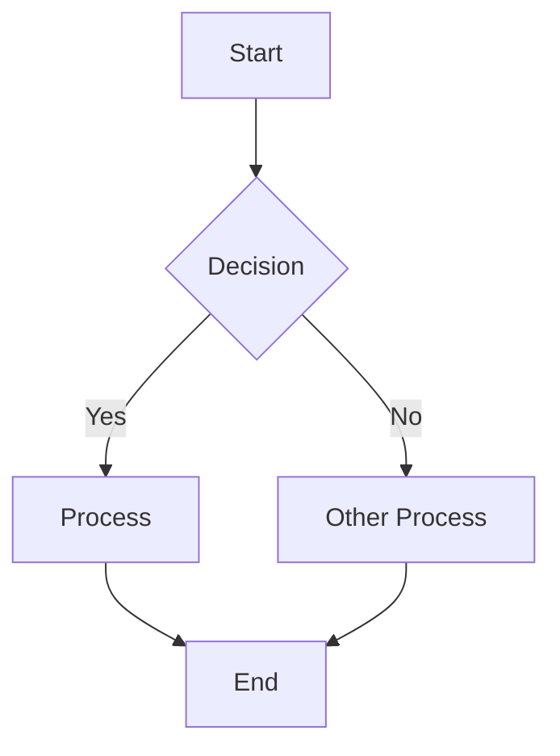
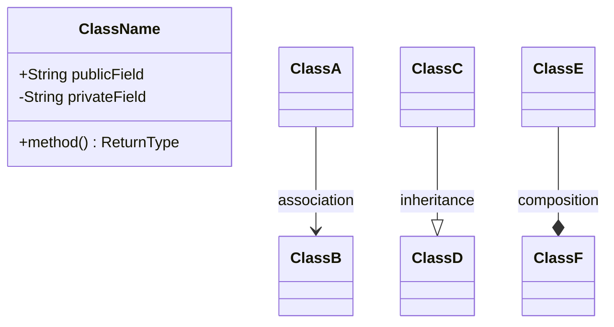
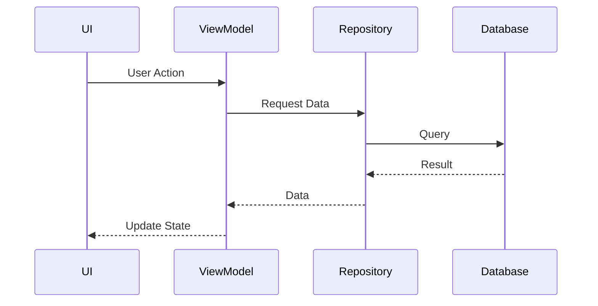
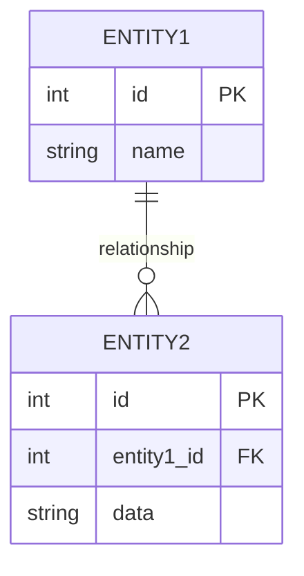

# Android Documentation Quick Reference Guide

**Quick lookup guide for VoxPlan documentation standards**

---

## KDoc Quick Syntax

### Basic Template

```kotlin
/**
 * Brief one-line summary (noun/verb phrase, not complete sentence).
 *
 * Detailed description explaining purpose, behavior, and important details.
 * Can span multiple paragraphs.
 *
 * @param paramName Description of parameter
 * @param anotherParam Description of another parameter
 * @return Description of return value
 * @throws ExceptionType When this is thrown
 * @see RelatedClass
 * @sample com.example.Samples.exampleFunction
 */
```

### Supported Tags

| Tag | Use For | Example |
|-----|---------|---------|
| `@param` | Function parameters | `@param userId User's unique ID` |
| `@return` | Return values | `@return Flow of daily events` |
| `@property` | Class properties | `@property name User's display name` |
| `@constructor` | Constructors | `@constructor Creates instance with DAO` |
| `@receiver` | Extension functions | `@receiver The date to format` |
| `@throws` | Exceptions | `@throws IllegalArgumentException if empty` |
| `@see` | Related items | `@see DailyRepository` |
| `@sample` | Code examples | `@sample com.example.Samples.func` |
| `@suppress` | Hide from docs | (No description needed) |

### Markdown in KDoc

```kotlin
/**
 * # Main heading
 * ## Subheading
 *
 * **Bold text** and *italic text*
 *
 * Lists:
 * - Item 1
 * - Item 2
 *
 * Links:
 * - [OtherClass] - to another class
 * - [functionName] - to a function
 * - [custom text][ClassName] - with custom text
 *
 * Code:
 * `inline code`
 *
 * ```kotlin
 * val example = "code block"
 * ```
 */
```

---

## Component-Specific Templates

### Entity (Room)

```kotlin
/**
 * Represents [concept] in the database.
 *
 * [Brief description of purpose and relationships]
 *
 * Database Details:
 * - Table: "[table_name]"
 * - Primary Key: [keyField] (auto-generated/manual)
 * - Indices: [describe indices]
 * - Foreign Keys: [describe relationships]
 *
 * @property id [Description]
 * @property field [Description with constraints]
 *
 * @see RelatedEntity
 * @see RelatedDao
 */
```

### DAO (Room)

```kotlin
/**
 * Data access object for [entity name] operations.
 *
 * Provides methods for [list main operations]. All queries return
 * Flow for reactive updates. Room handles background execution
 * automatically for Flow queries.
 *
 * Thread Safety: All suspend functions safe to call from main thread.
 *
 * @see EntityClass
 * @see RepositoryClass
 */
@Dao
interface ExampleDao {
    /**
     * [Action description].
     *
     * [Details about behavior, triggers, etc.]
     *
     * @param param [Description]
     * @return [Description of result]
     */
    @Query("SELECT * FROM table WHERE field = :param")
    fun queryMethod(param: String): Flow<List<Entity>>
}
```

### Repository

```kotlin
/**
 * Repository for [domain] data operations.
 *
 * Implements Repository pattern to provide clean API for data access.
 * Acts as single source of truth for [domain] data, abstracting
 * [data source types].
 *
 * Design Pattern: Repository Pattern
 * - Centralizes data operations
 * - Provides clean API to ViewModels
 * - Abstracts data source implementation
 * - Enables testing through abstraction
 *
 * Thread Safety: [describe thread safety guarantees]
 *
 * @property dao [Description of DAO]
 * @constructor Creates repository with specified dependencies
 */
```

### ViewModel

```kotlin
/**
 * ViewModel for [screen name] screen state management.
 *
 * Manages UI state, handles user events, and coordinates data operations
 * through [repository name]. Exposes state via StateFlow for reactive UI.
 *
 * State Management:
 * - [stateField]: [Description]
 * - [anotherField]: [Description]
 *
 * Lifecycle: Survives configuration changes, cleared when screen removed
 *
 * @param repository [Description]
 * @constructor Creates ViewModel with dependency injection
 */
```

### Composable Function

```kotlin
/**
 * Displays [what it displays].
 *
 * [Detailed description of UI behavior and appearance]
 *
 * State Management:
 * - Stateless/Stateful: [which one]
 * - Recomposition: [what triggers it]
 * - State hoisting: [describe pattern]
 *
 * @param data [Description]
 * @param onClick [Description of callback]
 * @param modifier [Standard modifier description]
 *
 * @sample com.example.Samples.previewFunction
 */
@Composable
fun ExampleComposable(
    data: DataType,
    onClick: () -> Unit,
    modifier: Modifier = Modifier
)
```

### Use Case (Clean Architecture)

```kotlin
/**
 * Use case for [business operation].
 *
 * Encapsulates business logic for [operation], including validation
 * and data transformation. Separates business logic from ViewModels.
 *
 * Clean Architecture Layer: Domain Layer (Use Case)
 *
 * Validation Rules:
 * - [Rule 1]
 * - [Rule 2]
 *
 * @property repository [Description]
 */
class ExampleUseCase(private val repository: Repository) {
    /**
     * Executes use case to [action].
     *
     * [Detailed description of execution flow]
     *
     * @param param [Description]
     * @return Result.Success with [data], or Result.Error with [message]
     */
    suspend operator fun invoke(param: Type): Result<ReturnType>
}
```

---

## Dokka Setup Checklist

### Project build.gradle.kts

```kotlin
plugins {
    id("org.jetbrains.dokka") version "2.0.0" apply false
}
```

### App build.gradle.kts

```kotlin
plugins {
    id("com.android.application")
    id("org.jetbrains.kotlin.android")
    id("org.jetbrains.dokka")  // After Android plugins!
}

tasks.dokkaHtml {
    outputDirectory.set(buildDir.resolve("dokka"))

    dokkaSourceSets.named("main") {
        moduleName.set("VoxPlan")

        // Suppress internal packages
        perPackageOption {
            matchingRegex.set(".*\\.internal.*")
            suppress.set(true)
        }
    }
}
```

### Generate Documentation

```bash
./gradlew dokkaHtml
# Output: build/dokka/html/index.html
```

---

## Mermaid Diagrams Quick Reference

### Flowchart (Data Flow)



### Class Diagram



### Sequence Diagram



### Entity Relationship



---

## Common Mistakes Checklist

### Avoid These:

- [ ] Missing @param or @return tags
- [ ] Using @deprecated tag (use @Deprecated annotation)
- [ ] Documenting obvious getters/setters
- [ ] Copying Java documentation style
- [ ] No examples in complex functions
- [ ] Outdated documentation
- [ ] Inconsistent terminology
- [ ] Missing database schema details
- [ ] Not explaining state management in Compose
- [ ] No architecture overview

### Do These Instead:

- [x] Document all public APIs
- [x] Use @Deprecated annotation with ReplaceWith
- [x] Focus on "why" not "what" for simple code
- [x] Use Kotlin-specific KDoc features
- [x] Include @sample references
- [x] Review docs during PR process
- [x] Create terminology glossary
- [x] Document tables, indices, foreign keys
- [x] Explain stateless/stateful composables
- [x] Create ARCHITECTURE.md with diagrams

---

## Documentation File Structure

### Recommended Project Docs

```
docs/
├── index.md                    # Overview
├── getting-started/
│   ├── installation.md
│   ├── setup.md
│   └── quick-start.md
├── architecture/
│   ├── overview.md            # High-level architecture
│   ├── data-layer.md          # Repository, DAO, DB
│   ├── domain-layer.md        # Use cases (if applicable)
│   ├── ui-layer.md            # Compose, ViewModels
│   └── diagrams/              # Mermaid/PlantUML files
├── features/
│   ├── daily-events.md
│   ├── quotas.md
│   └── settings.md
├── api/                       # Dokka-generated
│   ├── database/
│   ├── repositories/
│   ├── viewmodels/
│   └── ui/
├── development/
│   ├── contributing.md
│   ├── code-style.md
│   ├── testing.md
│   └── ci-cd.md
└── README.md                  # Main entry point
```

---

## README.md Essential Sections

1. **Project Title + Badges**
2. **Table of Contents**
3. **Overview** - What is this?
4. **Features** - What does it do?
5. **Screenshots** - What does it look like?
6. **Architecture** - How is it structured?
7. **Tech Stack** - What technologies?
8. **Getting Started**
   - Prerequisites
   - Installation
   - Building
   - Running
9. **Project Structure** - Directory layout
10. **Development**
    - Code style
    - Testing
    - Documentation
11. **Contributing**
12. **License**
13. **Contact**

---

## Key Resources

### Official Docs
- Android KDoc Guidelines: https://cs.android.com/androidx/platform/frameworks/support/+/androidx-main:docs/kdoc_guidelines.md
- Kotlin Style Guide: https://developer.android.com/kotlin/style-guide
- KDoc Reference: https://kotlinlang.org/docs/kotlin-doc.html

### Tools
- Dokka: https://github.com/Kotlin/dokka
- Mermaid: https://mermaid.js.org/
- MkDocs: https://www.mkdocs.org/
- PlantUML: https://plantuml.com/

### Generators
- MkDocs (Python): Simple, Markdown-based
- Docusaurus (React): Feature-rich, modern
- Dokka (Kotlin): Code → API docs

---

## Quick Commands

```bash
# Format code
./gradlew ktlintFormat

# Generate Dokka docs
./gradlew dokkaHtml

# Run tests
./gradlew test

# Build app
./gradlew assembleDebug

# Install app
./gradlew installDebug

# Generate test coverage
./gradlew testDebugUnitTestCoverage
```

---

## Documentation Review Checklist

Before submitting PR:

- [ ] All new public APIs have KDoc
- [ ] All parameters documented with @param
- [ ] Return values documented with @return
- [ ] Exceptions documented with @throws
- [ ] Examples provided for complex functions
- [ ] Architecture docs updated if needed
- [ ] README updated if user-facing changes
- [ ] Diagrams updated if structure changed
- [ ] Terminology consistent throughout
- [ ] Links to related components included
- [ ] Migration guide if breaking change
- [ ] Dokka builds without errors

---

**Last Updated:** 2025-11-10
**For Full Guide:** See `android_documentation_best_practices.md`
