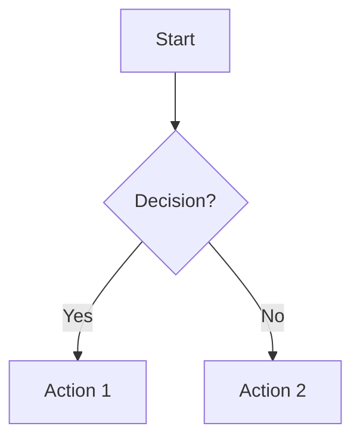
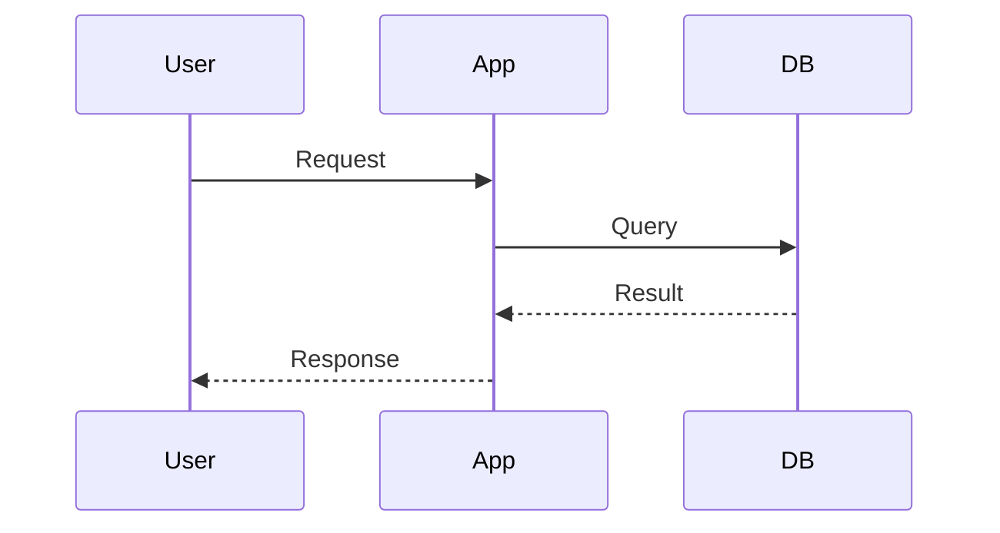
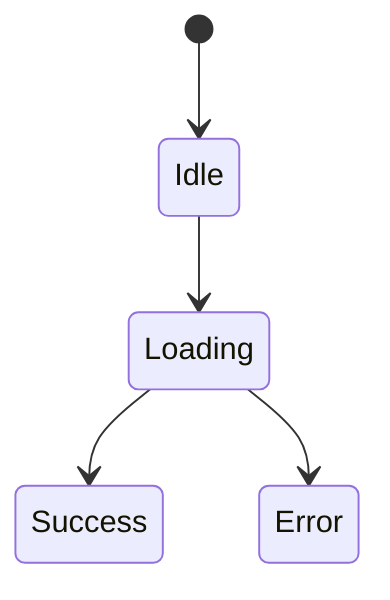
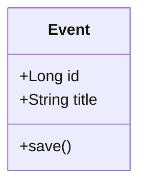

# Documentation Quick Reference Guide

This is a condensed reference for the most important documentation practices. For complete details, see [technical_documentation_best_practices.md](technical_documentation_best_practices.md).

---

## Documentation Structure (Diátaxis Framework)

| Type | Purpose | User Need | Example |
|------|---------|-----------|---------|
| **Tutorial** | Learning | "I want to learn" | "Building Your First Feature" |
| **How-To** | Problem-solving | "I want to accomplish X" | "How to Add a New Screen" |
| **Reference** | Information lookup | "I need to look up Y" | API docs, config options |
| **Explanation** | Understanding | "I want to understand why" | Architecture decisions |

**Rule**: Don't mix these types. Each document should have one clear purpose.

---

## Essential README Sections

```markdown
# Project Name

[One-line description]

## Features
- Key feature 1
- Key feature 2

## Quick Start
[Get running in 5 minutes]

## Installation
[Detailed setup]

## Documentation
- [Architecture](docs/architecture.md)
- [API Reference](docs/api.md)
- [Contributing](CONTRIBUTING.md)

## License
[License info]
```

---

## Mermaid Diagram Quick Reference

### Flowchart


### Sequence Diagram


### State Diagram


### Class Diagram


Live editor: https://mermaid.live/

---

## ADR Template (Architecture Decision Records)

```markdown
# ADR-001: Use MVVM Architecture

**Date**: 2025-11-10
**Status**: Accepted

## Context
[Why this decision is needed]

## Decision
We will use MVVM architecture pattern.

## Rationale
**Pros**:
- Clear separation of concerns
- Testable business logic

**Cons**:
- More boilerplate code

**Alternatives Considered**:
- MVC: Rejected due to tight coupling
- MVP: Rejected due to complexity

## Consequences
**Positive**:
- Better testability
- Clear responsibilities

**Negative**:
- Learning curve for new developers
```

Store in: `docs/architecture/adr/001-decision-title.md`

---

## API Documentation Format

```markdown
### Create Event

**Endpoint**: `POST /events`

**Parameters**:

| Name | Type | Required | Description |
|------|------|----------|-------------|
| title | String | Yes | Event title |
| startTime | DateTime | Yes | Start time |

**Request Example**:
```kotlin
eventRepository.createEvent(title = "Meeting", startTime = now())
```

**Response**:
```json
{
  "id": 123,
  "title": "Meeting"
}
```

**Errors**:
- 400: Invalid parameters
- 404: Resource not found
```

---

## Scannable Documentation Checklist

- [ ] Descriptive headings (not "Introduction", "Methods")
- [ ] Front-load important info (answer first, details after)
- [ ] Use bullet lists instead of long paragraphs
- [ ] Bold key terms for scanning
- [ ] Include code examples with syntax highlighting
- [ ] Add table of contents for long docs
- [ ] Use tables for structured data
- [ ] Add visual breaks (diagrams, code blocks)
- [ ] Include "Quick Reference" sections
- [ ] Cross-reference related content

---

## Documentation Anti-Patterns to Avoid

| Anti-Pattern | Fix |
|--------------|-----|
| **Too much info** | Use progressive disclosure, link to details |
| **Vague language** | Be specific: "processes 1000 events/sec" not "fast" |
| **Inconsistent terms** | Use same term throughout: "Event" not "Task/Activity/Item" |
| **No examples** | Every API needs a working code example |
| **Outdated info** | Add "Last updated: YYYY-MM-DD" dates |
| **Missing context** | Explain WHY, not just WHAT |
| **Duplicate content** | Single source of truth, link elsewhere |
| **Poor structure** | Use templates, consistent organization |

---

## The 4 C's of Quality Documentation

1. **Clarity**: Easy to understand, unambiguous
2. **Conciseness**: Brief but complete
3. **Correctness**: Accurate and up-to-date
4. **Completeness**: All necessary information included

---

## Markdown Best Practices

### Code Blocks
```markdown
```kotlin
// Always specify language
fun example() = "with syntax highlighting"
```
```

### Tables
```markdown
| Left | Center | Right |
|:-----|:------:|------:|
| L    | C      | R     |
```

### Links
```markdown
See [Event API](../api/events.md) for details.
```

### Emphasis
- **Bold** for key terms
- *Italic* for emphasis
- `code` for technical terms

---

## When to Update Documentation

**Must Update**:
- Adding features
- Changing APIs
- Modifying configuration
- Breaking changes
- Bug fixes (if user-visible)
- New releases

**Review Periodically**:
- Before each release
- Quarterly for active projects
- During onboarding (get feedback)

---

## Version Control for Docs

```bash
# Good commit messages for documentation
docs: add event state machine diagram
docs: update API reference for v3.2
docs: fix broken links in setup guide
docs: clarify quota calculation explanation
```

**Versioning**:
- v1.0 → v1.1: Minor updates (new sections, fixes)
- v1.x → v2.0: Major restructure or rewrite

---

## Example Directory Structure

```
project-root/
├── README.md                    # Overview + quick start
├── CHANGELOG.md                 # Version history
├── ARCHITECTURE.md              # Top-level architecture
├── docs/
│   ├── architecture/
│   │   ├── overview.md
│   │   ├── data-flow.md
│   │   └── adr/               # Architecture decisions
│   │       └── 001-use-mvvm.md
│   ├── api/
│   │   └── events.md          # API reference
│   ├── guides/
│   │   ├── quick-start.md     # Getting started
│   │   ├── setup.md           # Dev setup
│   │   └── contributing.md    # How to contribute
│   └── reference/
│       ├── configuration.md   # Config options
│       └── troubleshooting.md # Common issues
```

---

## Code Comment Guidelines

**DO Comment**:
- Complex algorithms
- Non-obvious workarounds
- Performance-critical code
- Regex patterns
- Magic numbers

**DON'T Comment**:
- Obvious code
- Redundant restatements
- Commented-out code (delete it)

**Example**:
```kotlin
// BAD: Obvious
// Increment counter
counter++

// GOOD: Explains why
// Skip if already completed to avoid unnecessary DB queries
if (quota.isCompleted) return

// GOOD: Documents complex logic
// Calculate weighted average using exponential decay.
// Recent events have higher weight: weight = e^(-days/30)
val average = events.sumOf {
    exp(-it.daysSince / 30.0) * it.value
} / totalWeight
```

---

## Function Documentation (KDoc)

```kotlin
/**
 * Calculates the completion percentage for a quota.
 *
 * Uses only events from the current period as defined by
 * the quota's [periodType].
 *
 * @param quotaId The unique identifier of the quota
 * @param periodStart Start of time period
 * @param periodEnd End of time period
 * @return Completion percentage (0-100), or null if not found
 * @throws IllegalArgumentException if periodEnd < periodStart
 *
 * @see Quota.periodType
 */
suspend fun calculateProgress(
    quotaId: Long,
    periodStart: LocalDateTime,
    periodEnd: LocalDateTime
): Int?
```

---

## Visual Hierarchy for Scanning

```markdown
# Page Title (H1) - Largest

Brief intro paragraph front-loading key information.

## Major Section (H2) - Large

Regular body text with **bold key terms** for scanning.

### Subsection (H3) - Medium

- Bullet points
- Break up
- Dense text

#### Details (H4) - Smaller

Fine details for deep dives.
```

**Users scan in F-pattern**:
- Horizontal across the top
- Down the left side
- Key info in these high-attention areas

---

## Well-Documented Android Projects to Study

1. **AntennaPod**: https://github.com/AntennaPod/AntennaPod
   - Comprehensive contributor guide
   - Clear architecture docs

2. **Signal Android**: https://github.com/signalapp/Signal-Android
   - Security documentation
   - Build instructions

3. **Foodium**: https://github.com/PatilShreyas/Foodium
   - Modern architecture examples
   - Clear diagrams

4. **NotyKT**: https://github.com/PatilShreyas/NotyKT
   - Full-stack documentation
   - API reference

---

## Useful Tools

**Diagramming**:
- Mermaid Live: https://mermaid.live/
- ASCIIFlow: https://asciiflow.com/
- Textik: https://textik.com/

**Badges**:
- Shields.io: https://shields.io/
- Badge collection: https://github.com/Naereen/badges

**Examples**:
- Awesome README: https://github.com/matiassingers/awesome-readme
- ADR Templates: https://github.com/joelparkerhenderson/architecture-decision-record

**Guides**:
- Diátaxis Framework: https://diataxis.fr/
- API Documentation: https://idratherbewriting.com/learnapidoc/

---

## Quick Improvement Actions

To immediately improve documentation:

1. Add table of contents to long docs
2. Convert paragraphs to bullet lists
3. Add code examples to APIs
4. Create architecture diagram
5. Use descriptive headings
6. Add "last updated" dates
7. Link related documents
8. Create quick start guide
9. Remove outdated content
10. Add Mermaid diagrams

---

**Document Version**: 1.0
**Last Updated**: 2025-11-10
**Full Guide**: [technical_documentation_best_practices.md](technical_documentation_best_practices.md)
