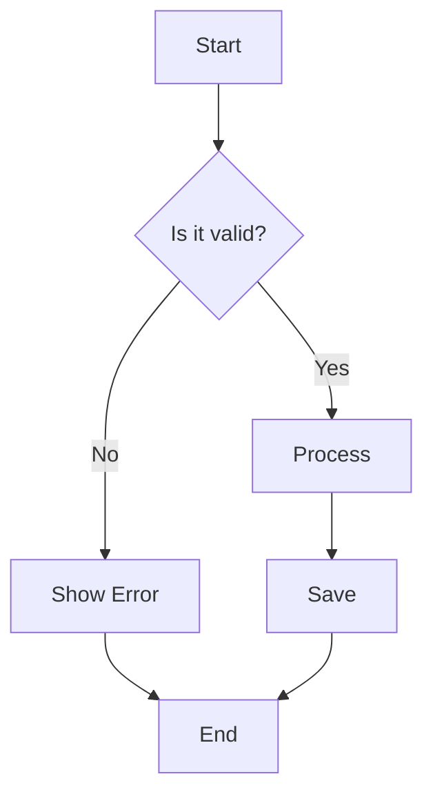
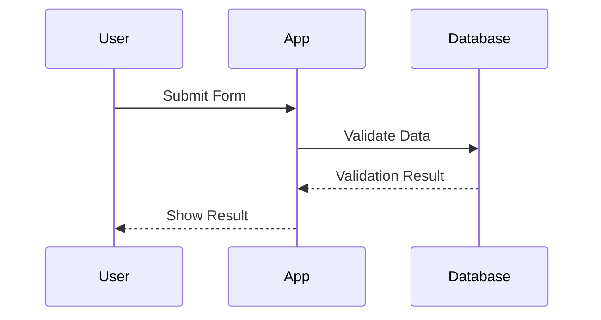
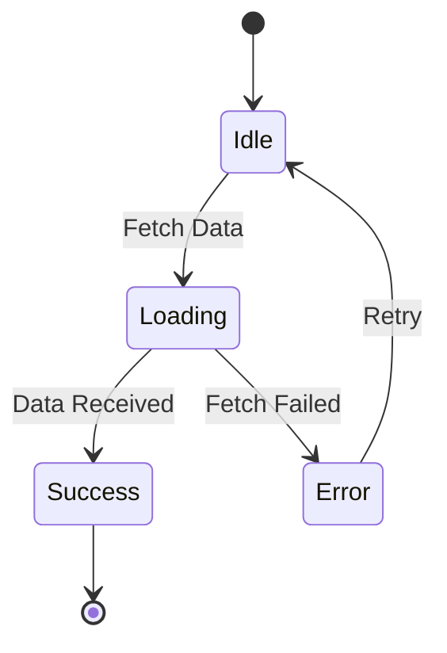
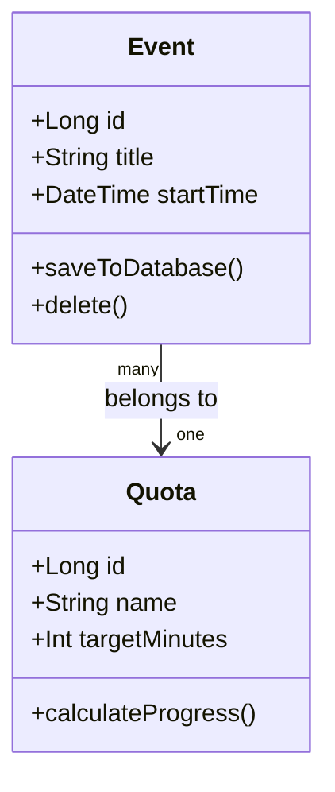
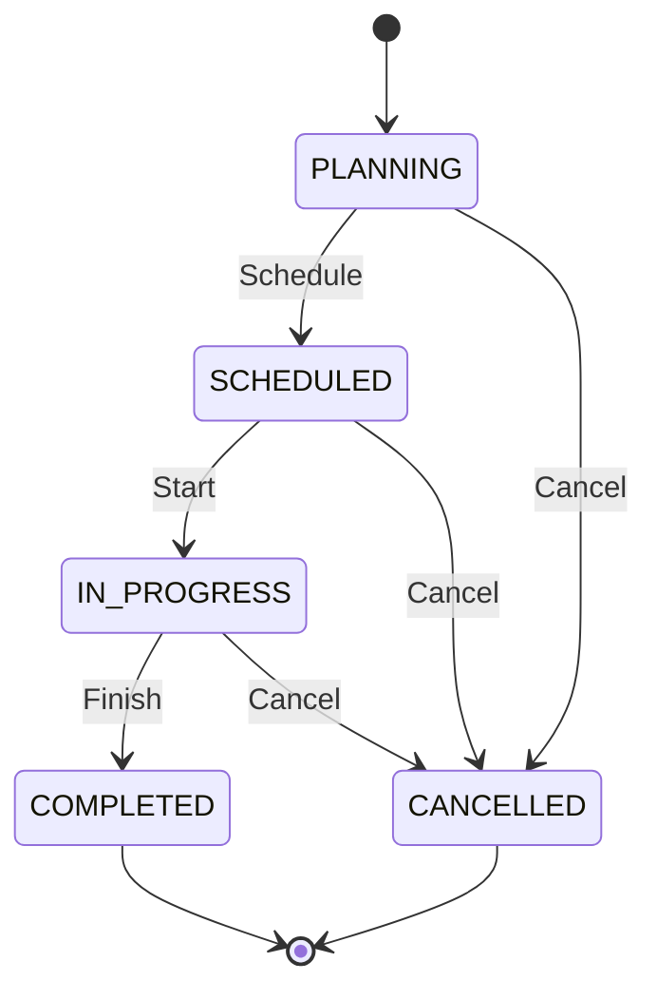
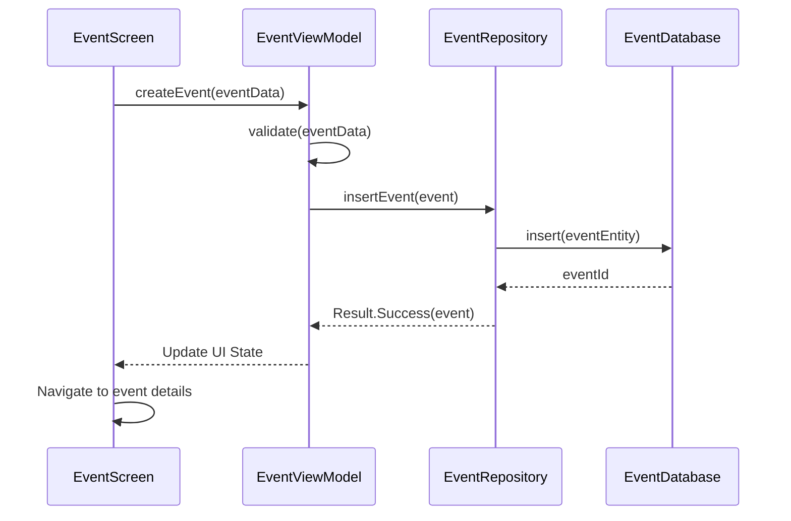

# Technical Documentation Best Practices Research

**Research Date:** 2025-11-10
**Purpose:** Comprehensive guide for creating effective technical documentation for complex codebases

---

## Table of Contents

1. [Documentation Architecture](#documentation-architecture)
2. [Markdown Best Practices](#markdown-best-practices)
3. [Code Documentation Patterns](#code-documentation-patterns)
4. [Successful Documentation Examples](#successful-documentation-examples)
5. [Completeness Standards](#completeness-standards)
6. [Documentation Anti-Patterns](#documentation-anti-patterns)
7. [Templates and Structures](#templates-and-structures)
8. [Scannable Documentation Design](#scannable-documentation-design)

---

## 1. Documentation Architecture

### Multi-File Project Structure

#### Core Principles

1. **Centralized Repository**: Keep all documentation in a dedicated location (e.g., `/docs` or `.claude/docs`)
2. **Standard Structure**: Use predictable layouts so developers can quickly find what they need
3. **Clear Naming Conventions**: Use descriptive, consistent names
   - Format: `ProjectName_DocumentType_VersionNumber_Date`
   - Example: `VoxPlan_Architecture_v1.0_2025-11-10.md`

#### Recommended Directory Structure

```
project-root/
├── README.md                          # Project overview and quick start
├── docs/
│   ├── architecture/
│   │   ├── overview.md                # High-level architecture
│   │   ├── data-flow.md               # Data flow documentation
│   │   ├── state-machines.md          # State machine documentation
│   │   └── adr/                       # Architecture Decision Records
│   │       ├── 001-use-kotlin.md
│   │       └── 002-mvvm-pattern.md
│   ├── api/
│   │   ├── endpoints.md               # API reference
│   │   └── authentication.md          # Auth documentation
│   ├── guides/
│   │   ├── quick-start.md             # Getting started guide
│   │   ├── setup.md                   # Development setup
│   │   ├── contributing.md            # Contribution guidelines
│   │   └── testing.md                 # Testing guide
│   ├── reference/
│   │   ├── configuration.md           # Configuration options
│   │   └── troubleshooting.md         # Common issues
│   └── explanations/
│       ├── design-decisions.md        # Why choices were made
│       └── technical-concepts.md      # Complex concepts explained
├── CHANGELOG.md                       # Version history
└── ARCHITECTURE.md                    # Architecture overview (top-level)
```

### Navigation Strategies

#### 1. Top-Level Structure
- Organize content into clear sections (API docs, guides, reference, etc.)
- Use a navigation bar with drop-down menus for grouped content
- Create intuitive hierarchies that match mental models

#### 2. Landing Pages
- Create welcoming entry points explaining documentation purpose
- Link to popular/essential pages using cards and imagery
- Include "Getting Started" or "New Here?" sections prominently

#### 3. Cross-Referencing
- **Don't duplicate content** - Link to existing explanations instead
- Add links when concepts are first mentioned
- Include "Related Content" sections at the end of documents
- Use relative links for internal documentation

Example:
```markdown
For details on state transitions, see [State Machine Documentation](../architecture/state-machines.md).
```

#### 4. Table of Contents
- Auto-generate TOC for documents longer than 3 sections
- Include "On this page" navigation for quick jumps
- Use heading hierarchy (H1 → H4) to create clear outlines

### Information Hierarchy

#### The Diátaxis Framework

Organize documentation into four distinct types based on user needs:

| Type | Purpose | When to Use | Example |
|------|---------|-------------|---------|
| **Tutorials** | Learning-oriented | Onboarding new developers | "Build your first feature" |
| **How-To Guides** | Task-oriented | Solving specific problems | "How to add a new screen" |
| **Reference** | Information-oriented | Looking up specifics | API documentation, config options |
| **Explanation** | Understanding-oriented | Deep dives into concepts | Architecture decisions, design patterns |

#### Decision Criteria

**Write a Tutorial when:**
- Teaching fundamentals to beginners
- Guiding through a complete workflow
- Building confidence through success

**Write a How-To Guide when:**
- Addressing a specific real-world problem
- Assuming competent users need direction
- Providing practical, goal-focused steps

**Write Reference Documentation when:**
- Documenting APIs, parameters, configuration
- Providing factual, accurate technical details
- Users need to look up specific information

**Write Explanation when:**
- Providing context for decisions
- Connecting concepts to the bigger picture
- Answering "why" questions

### Quick Reference vs Deep-Dive

#### Quick Reference Strategy
- Place at the top of documents or in dedicated sections
- Use tables for scannable information
- Include common commands/patterns
- Focus on "what" rather than "why"

Example:
```markdown
## Quick Reference

| Task | Command |
|------|---------|
| Build project | `./gradlew build` |
| Run tests | `./gradlew test` |
| Start emulator | `emulator -avd Pixel_7_API_34` |
```

#### Deep-Dive Strategy
- Place after quick reference or in separate documents
- Include context, rationale, and alternatives
- Use diagrams to illustrate complex concepts
- Provide code examples with explanations

---

## 2. Markdown Best Practices

### Advanced Markdown Features

#### Code Blocks with Syntax Highlighting

Use triple backticks with language identifiers:

```markdown
```kotlin
class MainActivity : AppCompatActivity() {
    override fun onCreate(savedInstanceState: Bundle?) {
        super.onCreate(savedInstanceState)
        setContentView(R.layout.activity_main)
    }
}
```
```

**Best Practices:**
- Always specify the language for syntax highlighting
- Keep code blocks focused (10-30 lines ideal)
- Add comments to explain non-obvious parts
- Include context before code blocks

#### Table Formatting

Basic table structure:
```markdown
| Column 1 | Column 2 | Column 3 |
|----------|----------|----------|
| Data 1   | Data 2   | Data 3   |
```

**Column Alignment:**
```markdown
| Left-aligned | Center-aligned | Right-aligned |
|:-------------|:--------------:|--------------:|
| Left         | Center         | Right         |
```

**Best Practices:**
- Keep columns aligned in source for readability
- Use tables for structured data, not layout
- Include header row for context
- Consider alternatives for complex data (lists, diagrams)
- Maximum 5-6 columns for readability

#### Mermaid Diagrams

Mermaid enables creating diagrams directly in Markdown:

**Flowchart Example:**
```markdown

```

**Sequence Diagram Example:**
```markdown

```

**State Diagram Example:**
```markdown

```

**Class Diagram Example:**
```markdown

```

**Supported Diagram Types:**
- Flowcharts
- Sequence diagrams
- Class diagrams
- State diagrams
- Entity-relationship diagrams
- User journey diagrams
- Gantt charts
- Git graphs

**Mermaid Resources:**
- Live Editor: https://mermaid.live/
- Documentation: https://mermaid.js.org/
- Cheat Sheet: https://jojozhuang.github.io/tutorial/mermaid-cheat-sheet/

#### ASCII Diagrams

For simple diagrams or when Mermaid isn't supported:

```
┌─────────────┐         ┌─────────────┐
│   UI Layer  │────────▶│  ViewModel  │
└─────────────┘         └─────────────┘
                               │
                               ▼
                        ┌─────────────┐
                        │ Repository  │
                        └─────────────┘
                               │
                               ▼
                        ┌─────────────┐
                        │  Database   │
                        └─────────────┘
```

**Tools:**
- ASCIIFlow: https://asciiflow.com/
- Textik: https://textik.com/
- Diagon: https://arthursonzogni.com/Diagon/

#### Collapsible Sections

Use HTML details/summary tags for optional content:

```markdown
<details>
<summary>Click to expand detailed explanation</summary>

This content is hidden by default and can be expanded when needed.
Great for verbose examples, stack traces, or optional deep-dives.

</details>
```

#### Badges

Add visual indicators for project status:

```markdown


```

**Common Badge Types:**
- Build status
- Version number
- Test coverage
- License
- Platform support
- Language

**Resources:**
- Shields.io: https://shields.io/
- Badge collection: https://github.com/Naereen/badges

---

## 3. Code Documentation Patterns

### Architecture Documentation

#### High-Level Overview

**What to Include:**
1. **System Context**: How the application fits in the larger ecosystem
2. **Component Diagram**: Major modules and their relationships
3. **Technology Stack**: Languages, frameworks, libraries used
4. **Key Patterns**: Architectural patterns (MVVM, Clean Architecture, etc.)
5. **Data Flow**: How information moves through the system

**Example Structure:**

```markdown
# Architecture Overview

## System Context
VoxPlan is a standalone Android application for time management...

## Architecture Pattern
The application follows MVVM (Model-View-ViewModel) architecture with:
- **View**: Activities and Fragments (UI layer)
- **ViewModel**: Business logic and UI state
- **Model**: Data layer (Repository, Database, Network)

## Component Diagram

[Include Mermaid or image diagram here]

## Technology Stack
- **Language**: Kotlin
- **UI**: Jetpack Compose
- **Database**: Room
- **Async**: Kotlin Coroutines
- **DI**: Hilt/Dagger

## Data Flow

1. User interacts with UI (View)
2. View calls ViewModel method
3. ViewModel requests data from Repository
4. Repository fetches from Database or Network
5. Data flows back through ViewModel to View
```

#### Component Documentation

For each major component, document:

```markdown
## [Component Name]

### Purpose
Brief description of what this component does and why it exists.

### Responsibilities
- Specific task 1
- Specific task 2
- Specific task 3

### Dependencies
- Component A (for X functionality)
- Component B (for Y functionality)

### Key Classes
- `ClassName1`: Description
- `ClassName2`: Description

### Usage Example
[Code snippet showing how to use this component]

### Related Components
- Links to related documentation
```

### State Machine Documentation

State machines are common in applications and need clear documentation:

#### State Diagram

Use Mermaid or ASCII to visualize states and transitions:

```markdown
## Event State Machine

### States

| State | Description |
|-------|-------------|
| `PLANNING` | Event is in planning phase, can be edited freely |
| `SCHEDULED` | Event is scheduled but not started |
| `IN_PROGRESS` | Event is currently happening |
| `COMPLETED` | Event has finished |
| `CANCELLED` | Event was cancelled |

### State Transitions



### Transition Rules

| From State | To State | Trigger | Conditions |
|-----------|----------|---------|------------|
| PLANNING | SCHEDULED | `schedule()` | Has valid start time |
| SCHEDULED | IN_PROGRESS | `start()` | Current time >= start time |
| IN_PROGRESS | COMPLETED | `complete()` | None |
| Any | CANCELLED | `cancel()` | Not already completed |
```

#### State Management Code

Document the implementation:

```markdown
### Implementation

```kotlin
enum class EventState {
    PLANNING,
    SCHEDULED,
    IN_PROGRESS,
    COMPLETED,
    CANCELLED
}

class Event(
    var state: EventState = EventState.PLANNING
) {
    fun schedule(startTime: DateTime): Result<Unit> {
        return when (state) {
            EventState.PLANNING -> {
                state = EventState.SCHEDULED
                Result.success(Unit)
            }
            else -> Result.failure(IllegalStateException("Cannot schedule from $state"))
        }
    }
}
```

### Key Design Decisions
- State transitions are explicit and validated
- Invalid transitions throw exceptions to catch bugs early
- State changes emit events for observers
```

### Data Flow Documentation

#### Flow Diagrams

Use sequence diagrams to show interactions:

```markdown
## Create Event Flow



### Data Flow Description

1. **User Input**: User fills form and taps "Create"
2. **Validation**: ViewModel validates event data
3. **Repository Call**: ViewModel calls repository to persist
4. **Database Operation**: Repository converts to entity and saves
5. **Success Propagation**: Success flows back through layers
6. **UI Update**: UI shows success and navigates
```

### API Reference Formatting

For internal APIs (classes, methods, functions):

#### Class Documentation

```markdown
## EventViewModel

### Description
Manages UI state and business logic for event-related screens.

### Constructor Parameters

| Parameter | Type | Description |
|-----------|------|-------------|
| `eventRepository` | `EventRepository` | Repository for event data access |
| `quotaRepository` | `QuotaRepository` | Repository for quota data |
| `coroutineScope` | `CoroutineScope` | Scope for launching coroutines |

### Public Methods

#### createEvent()

Creates a new event and saves it to the database.

**Signature:**
```kotlin
suspend fun createEvent(eventData: EventData): Result<Event>
```

**Parameters:**
- `eventData: EventData` - The event data from the form

**Returns:**
- `Result<Event>` - Success with created event, or Failure with error

**Throws:**
- `ValidationException` - If event data is invalid

**Example:**
```kotlin
viewModelScope.launch {
    val result = viewModel.createEvent(eventData)
    result.onSuccess { event ->
        // Handle success
    }.onFailure { error ->
        // Handle error
    }
}
```

**Related:**
- [Event Data Class](#event-data-class)
- [Event Repository](#event-repository)
```

### Inline Code Comments

#### When to Comment

**DO Comment:**
- Complex algorithms or business logic
- Non-obvious workarounds or hacks
- Performance-critical sections
- Security-sensitive code
- Regex patterns
- Magic numbers (with explanation)

**DON'T Comment:**
- Obvious code that explains itself
- Redundant restatements of code
- Commented-out code (delete it, use version control)
- Implementation details better suited for docs

#### Comment Best Practices

```kotlin
// BAD: Redundant comment
// Increment counter by 1
counter++

// GOOD: Explains WHY
// Skip processing if quota is already completed to avoid unnecessary database queries
if (quota.isCompleted) return

// GOOD: Explains complex logic
// Calculate weighted average using exponential decay.
// More recent events have higher weight: weight = e^(-days/30)
val weightedAverage = events.sumOf { event ->
    val daysSince = ChronoUnit.DAYS.between(event.date, today)
    val weight = exp(-daysSince / 30.0)
    event.minutes * weight
} / totalWeight

// GOOD: Documents constraints
// Note: This must be called on the main thread due to UI updates
@MainThread
fun updateUI() { ... }

// GOOD: Explains workaround
// HACK: WorkManager constraints don't work reliably on some Samsung devices
// running Android 11, so we manually check network state
if (isNetworkAvailable() || isSamsungAndroid11()) { ... }
```

#### Function/Method Documentation

Use KDoc for Kotlin (similar to JavaDoc):

```kotlin
/**
 * Calculates the completion percentage for a quota based on logged events.
 *
 * The calculation uses only events from the current time period as defined
 * by the quota's [Quota.periodType]. Events from other periods are ignored.
 *
 * @param quotaId The unique identifier of the quota
 * @param periodStart The start of the time period to consider
 * @param periodEnd The end of the time period to consider
 * @return The completion percentage (0-100), or null if quota doesn't exist
 * @throws IllegalArgumentException if periodEnd is before periodStart
 *
 * @see Quota.periodType
 * @see Event.calculateDuration
 */
suspend fun calculateQuotaProgress(
    quotaId: Long,
    periodStart: LocalDateTime,
    periodEnd: LocalDateTime
): Int? {
    require(periodEnd >= periodStart) { "Period end must be after start" }
    // Implementation...
}
```

---

## 4. Successful Documentation Examples

### Well-Documented Android Projects

#### Production Apps with Excellent Documentation

1. **AntennaPod** (Podcast Manager)
   - GitHub: https://github.com/AntennaPod/AntennaPod
   - Strengths: Comprehensive contributor guide, architecture docs, user docs

2. **Signal Android**
   - GitHub: https://github.com/signalapp/Signal-Android
   - Strengths: Security documentation, build instructions, contribution process

3. **K-9 Mail**
   - GitHub: https://github.com/thundernest/k-9
   - Strengths: Clear project structure, development setup guide

#### Sample Apps with Modern Architecture

1. **Foodium** (Modern Android Development)
   - GitHub: https://github.com/PatilShreyas/Foodium
   - Strengths: Architecture diagrams, technology explanations, clean code

2. **NotyKT** (Full-Stack Kotlin)
   - GitHub: https://github.com/PatilShreyas/NotyKT
   - Strengths: Complete stack documentation, API docs, architecture

3. **Jetcaster** (Jetpack Compose Sample)
   - GitHub: https://github.com/android/compose-samples
   - Strengths: Modern UI patterns, Compose best practices

4. **UAMP** (Universal Android Music Player)
   - GitHub: https://github.com/android/uamp
   - Strengths: Progressive disclosure, linked documentation, clear structure

### What Makes These Projects' Documentation Effective

#### Common Patterns

1. **Visual Project Overview**
   - Logo/banner at top
   - Screenshots showing functionality
   - Architecture diagrams
   - Badges showing build status, version

2. **Clear README Structure**
   - What the project does (1-2 sentences)
   - Key features (bullet list)
   - Screenshots/GIFs
   - Quick start guide
   - Links to detailed documentation
   - Contribution guidelines
   - License

3. **Comprehensive Architecture Documentation**
   - High-level overview diagram
   - Component descriptions
   - Design pattern explanations
   - Technology choices and rationale

4. **Progressive Disclosure**
   - README provides overview and quick start
   - Links to detailed docs for deep dives
   - Separate docs for different concerns (setup, API, contributing)

5. **Developer Onboarding Focus**
   - "Zero-to-deployed" guides
   - Step-by-step setup instructions
   - Common pitfalls and solutions
   - First contribution guide

6. **Active Maintenance**
   - Up-to-date with latest dependencies
   - Changelog documenting changes
   - Clear deprecation notices
   - Regular documentation updates

---

## 5. Completeness Standards

### The 4 C's of Documentation Quality

1. **Clarity**: Easy to understand, unambiguous language
2. **Conciseness**: Brief but complete, no unnecessary details
3. **Correctness**: Accurate, up-to-date, verified information
4. **Completeness**: All necessary information included

### Essential Documentation Sections

#### For Projects (README.md)

**Minimum Required:**
- [ ] Project name and description (1-2 sentences)
- [ ] Key features list
- [ ] Installation/setup instructions
- [ ] Basic usage example
- [ ] License information

**Recommended:**
- [ ] Screenshots or demo
- [ ] Prerequisites
- [ ] Build instructions
- [ ] Configuration options
- [ ] Link to detailed documentation
- [ ] Contribution guidelines
- [ ] Support/contact information
- [ ] Acknowledgments/credits

**Advanced:**
- [ ] Badges (build status, version, coverage)
- [ ] Architecture diagram
- [ ] FAQ section
- [ ] Roadmap
- [ ] Changelog link
- [ ] Security policy
- [ ] Code of conduct

#### For Features

Each significant feature should have:

- [ ] **Purpose**: What problem does it solve?
- [ ] **Usage**: How to use it (with examples)
- [ ] **Configuration**: Available options and defaults
- [ ] **Limitations**: What it can't do
- [ ] **Examples**: Common use cases
- [ ] **API Reference**: Classes, methods, parameters

#### For APIs

Each endpoint/method should document:

- [ ] **Description**: What it does
- [ ] **Parameters**: Name, type, required/optional, description
- [ ] **Return Value**: Type and structure
- [ ] **Exceptions/Errors**: What can go wrong
- [ ] **Example**: Working code sample
- [ ] **Notes**: Important considerations

#### For Architecture

- [ ] **Overview**: High-level system description
- [ ] **Component Diagram**: Visual representation
- [ ] **Technology Stack**: Libraries and frameworks used
- [ ] **Design Patterns**: Patterns employed and why
- [ ] **Data Flow**: How information moves through system
- [ ] **State Management**: How state is handled
- [ ] **External Dependencies**: Third-party services
- [ ] **Architecture Decision Records**: Key decisions documented

### Documentation Completeness Checklist

Use this checklist to verify documentation quality:

#### Content Completeness
- [ ] All user-facing features documented
- [ ] All public APIs documented
- [ ] Architecture and design patterns explained
- [ ] Setup and installation covered
- [ ] Configuration options listed
- [ ] Common tasks have how-to guides
- [ ] Troubleshooting section exists

#### Accuracy
- [ ] Information matches current codebase version
- [ ] Code examples tested and working
- [ ] Links are valid and not broken
- [ ] Screenshots show current UI
- [ ] API signatures match actual code

#### Accessibility
- [ ] Table of contents for navigation
- [ ] Searchable (if hosted online)
- [ ] Clear heading hierarchy
- [ ] Code blocks have syntax highlighting
- [ ] Images have alt text
- [ ] Links are descriptive (not "click here")

#### Structure
- [ ] Consistent formatting throughout
- [ ] Logical organization and flow
- [ ] Related content cross-referenced
- [ ] Quick reference separate from deep dives
- [ ] Examples provided for complex topics

#### Maintenance
- [ ] Version number or date on documentation
- [ ] Changelog maintained
- [ ] Documentation review process defined
- [ ] Outdated sections marked or removed
- [ ] Owner/maintainer identified

### Documentation Maintenance Strategy

#### Update Triggers

**Must Update Documentation When:**
- Adding new features
- Changing public APIs
- Modifying configuration options
- Updating dependencies with breaking changes
- Fixing significant bugs
- Deprecating features
- Releasing new versions

**Review Documentation Periodically:**
- Before each release
- Quarterly for active projects
- When onboarding new team members (get feedback)

#### Version Control Best Practices

1. **Keep docs in version control** (with code, ideally)
2. **Use semantic versioning** for major doc updates
   - v1.0 → v1.1 for minor updates
   - v1.x → v2.0 for major restructures
3. **Write good commit messages** for doc changes
4. **Tag documentation** versions with code releases
5. **Use pull requests** for doc reviews

#### Changelog Format

```markdown
# Changelog

All notable changes to this project will be documented in this file.

The format is based on [Keep a Changelog](https://keepachangelog.com/),
and this project adheres to [Semantic Versioning](https://semver.org/).

## [Unreleased]

## [3.2.0] - 2025-11-10

### Added
- Dailies screen for viewing daily events
- Parent/child event relationships
- Quick event creation from dailies view

### Changed
- Improved quota progress calculation
- Updated Room database to version 5

### Fixed
- Events not showing correct duration
- Crash when deleting quota with events

### Deprecated
- Old event creation flow (will be removed in 4.0)

## [3.1.0] - 2025-10-15
...
```

---

## 6. Documentation Anti-Patterns

Common mistakes to avoid:

### 1. Including Too Much Information

**Problem:** Overwhelming readers with unnecessary details, tangents, and exhaustive explanations.

**Solution:**
- Focus on essential information
- Use progressive disclosure (overview → details)
- Link to additional resources instead of including everything
- Separate quick reference from deep dives

**Example:**

```markdown
<!-- BAD -->
To create an event, you'll need to use the createEvent() method which is
defined in the EventRepository class which implements the IEventRepository
interface which extends the BaseRepository interface. This method takes
an EventData object as a parameter, which is a data class defined in the
models package that contains properties for the event title, description,
start time, end time, and associated quota ID. The method returns a Result
type which is a sealed class that can be either Success or Failure...

<!-- GOOD -->
To create an event:

```kotlin
val result = eventRepository.createEvent(eventData)
```

See [Event API Reference](api/events.md) for full details.
```

### 2. Vague or Ambiguous Language

**Problem:** Using unclear terms that can be interpreted multiple ways.

**Solution:**
- Be specific and concrete
- Use precise technical terms
- Define acronyms and jargon on first use
- Provide examples to clarify meaning

**Example:**

```markdown
<!-- BAD -->
The system processes events quickly.

<!-- GOOD -->
The system processes up to 1,000 events per second on average hardware.

<!-- BAD -->
Configure the setting appropriately.

<!-- GOOD -->
Set `maxRetries` to 3 for most use cases, or 5 for unreliable networks.
```

### 3. Inconsistency

**Problem:** Using different terms for the same concept, or different formatting styles.

**Solution:**
- Create and follow a style guide
- Use consistent terminology throughout
- Apply consistent formatting
- Use templates for repetitive documentation

**Example:**

```markdown
<!-- BAD: Inconsistent terminology -->
Create a new Task in the Tasks screen.
Add an Event to your Schedule.
Insert an Activity into the Calendar.

<!-- GOOD: Consistent terminology -->
Create a new Event in the Events screen.
Add an Event to your Schedule.
Schedule an Event in the Calendar.
```

### 4. Poor Structure and Organization

**Problem:** No clear flow, missing sections, illogical ordering.

**Solution:**
- Use templates for consistent structure
- Organize from general → specific
- Group related information together
- Use clear headings and navigation

**Example:**

```markdown
<!-- BAD: Poor structure -->
# Documentation

Here's some stuff about the app. It uses Kotlin. Also you need to install
Android Studio. The database is Room. If you want to contribute, send a PR.
The app manages time. To build it use gradle.

<!-- GOOD: Clear structure -->
# VoxPlan Documentation

## What is VoxPlan?
VoxPlan is a time management app...

## Getting Started
1. Prerequisites
2. Installation
3. Building the project

## Architecture
- Technology stack
- Design patterns
- Component overview

## Contributing
...
```

### 5. Missing or Outdated Information

**Problem:** Documentation doesn't reflect current state of code, or critical info is missing.

**Solution:**
- Review docs during code reviews
- Add "last updated" dates to sections
- Remove deprecated information
- Include version numbers where relevant

**Example:**

```markdown
<!-- BAD: Outdated -->
This feature requires Android API level 21+.

<!-- GOOD: Current and specific -->
This feature requires Android API level 26+ (Android 8.0).
Last verified: 2025-11-10 with app version 3.2.0

<!-- BAD: Missing info -->
To configure the database, edit the settings.

<!-- GOOD: Complete info -->
To configure the database, edit `app/src/main/res/values/database_config.xml`:

```xml
<resources>
    <string name="db_name">voxplan_db</string>
    <integer name="db_version">5</integer>
</resources>
```

Default values are used if this file is not present.
```

### 6. Overusing Jargon

**Problem:** Assuming everyone knows technical terms without explanation.

**Solution:**
- Define technical terms on first use
- Link to glossary for complex terms
- Balance technical accuracy with accessibility
- Consider your audience's knowledge level

**Example:**

```markdown
<!-- BAD: Unexplained jargon -->
VoxPlan uses DI with Hilt for SoC and testability via mocking DAOs.

<!-- GOOD: Explained or simplified -->
VoxPlan uses Dependency Injection (DI) with Hilt. This provides:
- **Separation of Concerns (SoC)**: Components don't create their dependencies
- **Testability**: Easy to mock database access objects (DAOs) in tests

See [Dependency Injection Guide](guides/dependency-injection.md) for details.
```

### 7. Lack of Context

**Problem:** Providing isolated facts without explaining why they matter.

**Solution:**
- Explain the "why" behind the "what"
- Connect information to user goals
- Provide use cases and scenarios
- Show real-world applications

**Example:**

```markdown
<!-- BAD: No context -->
Set `enableBackgroundSync` to true.

<!-- GOOD: Context provided -->
Set `enableBackgroundSync` to true to keep events synchronized when the app
is in the background. This ensures your schedule stays up-to-date but may
increase battery usage.

Recommended for users who:
- Frequently access the app throughout the day
- Need real-time synchronization
- Don't mind moderate battery usage

Leave disabled if battery life is a priority.
```

### 8. No Examples

**Problem:** Only describing functionality without showing how to use it.

**Solution:**
- Include code examples for every API
- Show common use cases
- Provide before/after examples
- Include both simple and complex examples

**Example:**

```markdown
<!-- BAD: No example -->
The EventViewModel provides methods for managing events.

<!-- GOOD: With examples -->
The EventViewModel provides methods for managing events:

**Create an Event:**
```kotlin
viewModel.createEvent(
    title = "Team Meeting",
    startTime = LocalDateTime.now(),
    quotaId = 1L
)
```

**Update an Event:**
```kotlin
viewModel.updateEvent(
    eventId = 42L,
    title = "Updated Meeting Time"
)
```

**Delete an Event:**
```kotlin
viewModel.deleteEvent(eventId = 42L)
```
```

### 9. Duplicate Information

**Problem:** Same content repeated in multiple places, leading to inconsistency.

**Solution:**
- Have single source of truth for each concept
- Link to canonical documentation
- Update in one place, reference everywhere else
- Use includes/templates if documentation system supports it

### 10. Ignoring the User's Perspective

**Problem:** Writing from developer's perspective rather than user's needs.

**Solution:**
- Think about user goals and tasks
- Organize by what users want to accomplish
- Use task-based headings ("How to X" not "The X System")
- Test documentation with actual users

---

## 7. Templates and Structures

### README Template

```markdown
# [Project Name]


> Brief, compelling description of what your project does (1-2 sentences)


## Table of Contents

- [Features](#features)
- [Screenshots](#screenshots)
- [Getting Started](#getting-started)
  - [Prerequisites](#prerequisites)
  - [Installation](#installation)
  - [Building](#building)
- [Usage](#usage)
- [Architecture](#architecture)
- [Documentation](#documentation)
- [Contributing](#contributing)
- [License](#license)
- [Contact](#contact)
- [Acknowledgments](#acknowledgments)

## Features

- ✅ Feature 1: Brief description
- ✅ Feature 2: Brief description
- ✅ Feature 3: Brief description
- 🚧 Feature 4: Coming soon
- 📋 Feature 5: Planned

## Screenshots

| Home Screen | Event Details | Quota Overview |
|-------------|---------------|----------------|
|  |  |  |

## Getting Started

### Prerequisites

- Android Studio Arctic Fox or later
- JDK 11 or higher
- Android SDK with API 26+
- Gradle 7.0+

### Installation

1. Clone the repository:
```bash
git clone https://github.com/username/project-name.git
cd project-name
```

2. Open in Android Studio:
```
File → Open → Select project directory
```

3. Sync Gradle files:
```
File → Sync Project with Gradle Files
```

### Building

**Debug build:**
```bash
./gradlew assembleDebug
```

**Release build:**
```bash
./gradlew assembleRelease
```

**Run tests:**
```bash
./gradlew test
```

## Usage

### Quick Start

[5-minute tutorial to get users up and running]

```kotlin
// Quick example showing core functionality
val event = Event(
    title = "Example Event",
    startTime = LocalDateTime.now()
)
eventRepository.create(event)
```

### Common Tasks

- [How to create an event](docs/guides/create-event.md)
- [How to manage quotas](docs/guides/manage-quotas.md)
- [How to export data](docs/guides/export-data.md)

## Architecture

[Brief architecture overview with diagram]

```
┌─────────────────┐
│   UI Layer      │  Activities, Fragments, Composables
├─────────────────┤
│   ViewModel     │  Business Logic, UI State
├─────────────────┤
│   Repository    │  Data Access Abstraction
├─────────────────┤
│  Data Sources   │  Room DB, Network, Preferences
└─────────────────┘
```

See [Architecture Documentation](docs/architecture/overview.md) for details.

## Documentation

- [API Reference](docs/api/README.md)
- [Architecture Guide](docs/architecture/overview.md)
- [Contributing Guide](CONTRIBUTING.md)
- [Changelog](CHANGELOG.md)
- [FAQ](docs/FAQ.md)

## Contributing

We welcome contributions! Please see our [Contributing Guide](CONTRIBUTING.md) for details.

Quick links:
- [Code of Conduct](CODE_OF_CONDUCT.md)
- [Development Setup](docs/guides/development-setup.md)
- [Pull Request Process](docs/guides/pull-request-process.md)

## License

This project is licensed under the MIT License - see the [LICENSE](LICENSE) file for details.

## Contact

- **Project Link**: https://github.com/username/project-name
- **Issue Tracker**: https://github.com/username/project-name/issues
- **Email**: maintainer@example.com

## Acknowledgments

- [Library Name](https://example.com) - Used for X functionality
- [Design Assets](https://example.com) - Icons and graphics
- [Tutorial](https://example.com) - Inspired by this guide
```

### Architecture Decision Record (ADR) Template

```markdown
# ADR-[number]: [Short Title in Imperative Mood]

**Date**: YYYY-MM-DD
**Status**: [Proposed | Accepted | Deprecated | Superseded]
**Supersedes**: ADR-[number] (if applicable)
**Authors**: [Name(s)]

## Context

[Describe the issue motivating this decision, including:]
- Technical situation
- Business priorities
- Constraints or requirements
- Team considerations
- Relevant facts and forces at play

## Decision

[State the decision clearly and concisely]

We will [chosen approach] to [achieve goal].

## Rationale

[Explain why this decision was made:]
- Pros of chosen approach
- Cons that are acceptable
- Alternatives considered and why rejected
- Trade-offs being made

### Alternatives Considered

#### Option 1: [Alternative Approach]
- **Pros**: [Benefits]
- **Cons**: [Drawbacks]
- **Rejected because**: [Reason]

#### Option 2: [Another Alternative]
- **Pros**: [Benefits]
- **Cons**: [Drawbacks]
- **Rejected because**: [Reason]

## Consequences

[Describe the outcomes of this decision:]

### Positive
- [Benefit 1]
- [Benefit 2]

### Negative
- [Trade-off or cost 1]
- [Trade-off or cost 2]

### Neutral
- [Other impacts that are neither good nor bad]

## Implementation

[If relevant, describe how this decision will be implemented:]
- Steps to take
- Timeline
- Responsible parties
- Success criteria

## Follow-up

[If applicable, list any follow-up actions or related decisions needed:]
- [ ] Action item 1
- [ ] Action item 2
- [ ] Future decision needed on [topic]

## References

- [Link to related documentation]
- [Link to technical specs]
- [Link to discussion or RFC]
```

**File Naming**: `docs/architecture/adr/001-use-mvvm-architecture.md`

### API Endpoint Documentation Template

```markdown
# [Resource Name] API

## Overview

[Brief description of what this resource represents]

## Base URL

```
https://api.example.com/v1/events
```

---

## Endpoints

### List Events

Retrieves a paginated list of events.

**Endpoint:** `GET /events`

**Authentication:** Required

**Query Parameters:**

| Parameter | Type | Required | Default | Description |
|-----------|------|----------|---------|-------------|
| `page` | Integer | No | 1 | Page number (1-indexed) |
| `limit` | Integer | No | 20 | Items per page (max 100) |
| `quotaId` | Long | No | null | Filter by quota ID |
| `startDate` | ISO 8601 | No | null | Filter events starting after this date |
| `endDate` | ISO 8601 | No | null | Filter events ending before this date |

**Request Example:**

```bash
curl -X GET "https://api.example.com/v1/events?page=1&limit=10&quotaId=5" \
  -H "Authorization: Bearer YOUR_TOKEN"
```

**Response Example (200 OK):**

```json
{
  "data": [
    {
      "id": 123,
      "title": "Team Meeting",
      "description": "Weekly sync",
      "startTime": "2025-11-10T14:00:00Z",
      "endTime": "2025-11-10T15:00:00Z",
      "quotaId": 5,
      "createdAt": "2025-11-01T10:00:00Z",
      "updatedAt": "2025-11-05T12:30:00Z"
    }
  ],
  "pagination": {
    "page": 1,
    "limit": 10,
    "total": 45,
    "totalPages": 5
  }
}
```

**Error Responses:**

| Status Code | Description |
|-------------|-------------|
| 400 | Invalid parameters (e.g., limit > 100) |
| 401 | Unauthorized (missing or invalid token) |
| 403 | Forbidden (insufficient permissions) |
| 429 | Too many requests (rate limit exceeded) |
| 500 | Internal server error |

**Error Response Example (400):**

```json
{
  "error": {
    "code": "INVALID_PARAMETER",
    "message": "limit must be between 1 and 100",
    "field": "limit"
  }
}
```

---

### Create Event

Creates a new event.

**Endpoint:** `POST /events`

**Authentication:** Required

**Request Body:**

| Field | Type | Required | Description |
|-------|------|----------|-------------|
| `title` | String | Yes | Event title (max 200 chars) |
| `description` | String | No | Event description (max 1000 chars) |
| `startTime` | ISO 8601 | Yes | Event start time |
| `endTime` | ISO 8601 | Yes | Event end time (must be after startTime) |
| `quotaId` | Long | Yes | Associated quota ID |

**Request Example:**

```bash
curl -X POST "https://api.example.com/v1/events" \
  -H "Authorization: Bearer YOUR_TOKEN" \
  -H "Content-Type: application/json" \
  -d '{
    "title": "Project Review",
    "description": "Q4 project retrospective",
    "startTime": "2025-11-15T10:00:00Z",
    "endTime": "2025-11-15T11:30:00Z",
    "quotaId": 3
  }'
```

**Response Example (201 Created):**

```json
{
  "id": 124,
  "title": "Project Review",
  "description": "Q4 project retrospective",
  "startTime": "2025-11-15T10:00:00Z",
  "endTime": "2025-11-15T11:30:00Z",
  "quotaId": 3,
  "createdAt": "2025-11-10T15:22:33Z",
  "updatedAt": "2025-11-10T15:22:33Z"
}
```

**Validation Rules:**
- `title` must not be empty
- `endTime` must be after `startTime`
- `quotaId` must reference an existing quota
- Event duration must be at least 1 minute
- Event cannot overlap with existing events (optional, depends on business rules)

---

[Continue for other endpoints: GET /events/{id}, PUT /events/{id}, DELETE /events/{id}]

## Data Models

### Event

| Field | Type | Description |
|-------|------|-------------|
| `id` | Long | Unique identifier |
| `title` | String | Event title |
| `description` | String? | Optional description |
| `startTime` | DateTime | Start time (ISO 8601) |
| `endTime` | DateTime | End time (ISO 8601) |
| `quotaId` | Long | Associated quota ID |
| `createdAt` | DateTime | Creation timestamp |
| `updatedAt` | DateTime | Last update timestamp |

## Rate Limiting

- **Limit**: 100 requests per minute per API key
- **Headers**: Rate limit info included in response headers
  - `X-RateLimit-Limit`: Maximum requests per window
  - `X-RateLimit-Remaining`: Requests remaining in window
  - `X-RateLimit-Reset`: Time when limit resets (Unix timestamp)

## Authentication

All endpoints require authentication via Bearer token:

```
Authorization: Bearer YOUR_API_TOKEN
```

See [Authentication Guide](authentication.md) for details on obtaining tokens.

## Errors

All errors follow this format:

```json
{
  "error": {
    "code": "ERROR_CODE",
    "message": "Human-readable description",
    "field": "fieldName" // Optional, for validation errors
  }
}
```

Common error codes:
- `INVALID_PARAMETER`: Request parameter is invalid
- `MISSING_REQUIRED_FIELD`: Required field is missing
- `RESOURCE_NOT_FOUND`: Requested resource doesn't exist
- `UNAUTHORIZED`: Authentication required or failed
- `FORBIDDEN`: Insufficient permissions
- `RATE_LIMIT_EXCEEDED`: Too many requests

## Examples

See [API Examples](examples/) for complete workflows:
- [Creating and managing events](examples/event-workflow.md)
- [Batch operations](examples/batch-operations.md)
- [Error handling](examples/error-handling.md)
```

### How-To Guide Template

```markdown
# How to [Accomplish Task]

**Difficulty**: [Beginner | Intermediate | Advanced]
**Time**: ~[X] minutes
**Prerequisites**: [List requirements]

## Overview

[Brief 1-2 sentence summary of what this guide covers]

## What You'll Need

- [Prerequisite 1]
- [Prerequisite 2]
- [Tool or knowledge 3]

## Steps

### Step 1: [First Action]

[Clear instruction with explanation]

```kotlin
// Code example
```

**Expected Result**: [What should happen]

**Troubleshooting**: [Common issues and solutions]

### Step 2: [Second Action]

[Continue with clear steps...]

### Step 3: [Third Action]

[Each step builds on previous]

## Verification

[How to verify the task was completed successfully]

```bash
# Command to check result
```

Expected output:
```
[Show expected output]
```

## Next Steps

- [Related task 1]
- [Related task 2]
- [Link to advanced guide]

## Common Issues

### Issue: [Problem Description]

**Symptoms**: [How you know you have this problem]

**Cause**: [Why this happens]

**Solution**:
1. [Step to resolve]
2. [Step to resolve]

### Issue: [Another Problem]

[Same format]

## Related Resources

- [Link to related guide]
- [Link to reference documentation]
- [Link to example code]
```

---

## 8. Scannable Documentation Design

### The F-Pattern Reading Behavior

Research by Nielsen Norman Group shows that **79% of users scan** web pages rather than reading word-by-word. Understanding scanning patterns helps structure documentation effectively.

**Common Scanning Patterns:**

1. **F-Pattern**: Users read horizontally across the top, then down the left side
2. **Layer-Cake Pattern**: Users scan headings and subheadings, skipping content between
3. **Spotted Pattern**: Users look for specific keywords or visual elements

**Design Implication**: Place critical information in these high-attention areas.

### Visual Hierarchy Principles

#### 1. Size and Scale

Larger elements demand more attention:
- **Page title**: Largest (H1)
- **Section headings**: Large (H2)
- **Subsections**: Medium (H3)
- **Body text**: Standard size
- **Captions/notes**: Smaller

#### 2. Typography

```markdown
# Main Heading (H1) - Largest, boldest

## Section Heading (H2) - Large, bold

### Subsection (H3) - Medium, bold

Body text in regular weight and size.

**Important terms** in bold for scanning.

*Emphasis* in italics for subtle stress.

`Code terms` in monospace font.
```

#### 3. White Space

Generous spacing improves scannability:

```markdown
<!-- BAD: Dense, hard to scan -->
Events in VoxPlan are time blocks associated with quotas. They have start and end times and calculate their duration automatically. You can create events from the main screen or the dailies view and they support parent/child relationships for breaking down larger activities.

<!-- GOOD: Scannable with spacing -->
Events in VoxPlan are time blocks associated with quotas.

Key features:
- Start and end times with automatic duration calculation
- Creation from main screen or dailies view
- Parent/child relationships for activity breakdown

See [Event Documentation](events.md) for details.
```

#### 4. Lists and Bullets

Break up dense text:

```markdown
<!-- BAD: Paragraph form -->
To set up the development environment you need to install Android Studio, install the Android SDK with API level 26 or higher, install JDK 11 or higher, and clone the repository from GitHub.

<!-- GOOD: Bulleted list -->
To set up the development environment:

1. Install Android Studio
2. Install Android SDK (API 26+)
3. Install JDK 11 or higher
4. Clone the repository from GitHub
```

### Scannable Content Techniques

#### 1. Descriptive Headings

```markdown
<!-- BAD: Vague headings -->
## Introduction
## Methods
## Results

<!-- GOOD: Descriptive headings -->
## What is VoxPlan?
## How to Create an Event
## Architecture Patterns Used
```

#### 2. Front-Load Important Information

Use inverted pyramid style:

```markdown
<!-- GOOD: Answer first, details after -->
## How to Delete an Event

**Quick Answer**: Long-press the event and tap the delete icon.

**Detailed Steps**:
1. Navigate to the Events screen
2. Find the event you want to delete
3. Long-press the event item
4. Tap the trash icon in the action bar
5. Confirm deletion in the dialog

**Note**: This action cannot be undone.
```

#### 3. Visual Breaks

Use various elements to break up text:

```markdown
## Section Title

Regular paragraph text providing context...

**Key Point**: Highlighted important information.

```kotlin
// Code example providing visual break
val event = Event(title = "Example")
```

> **Note**: Blockquotes draw attention to warnings or tips.

| Feature | Status |
|---------|--------|
| Tables  | ✅     |


---

Continue with next section...
```

#### 4. Consistent Formatting

**Information Patterns:**

```markdown
## [Feature Name]

**Purpose**: [One sentence description]

**Usage**:
```kotlin
// Example code
```

**Parameters**:
- `param1`: Description
- `param2`: Description

**Returns**: [Return value description]

**Example**:
[Complete working example]
```

This pattern becomes recognizable, making it easy to scan.

#### 5. Progressive Disclosure

Start simple, provide depth optionally:

```markdown
## Configuration

**Quick Config** (Most Users):
```xml
<config value="default"/>
```

<details>
<summary>Advanced Configuration Options</summary>

For advanced users, additional options include:
- `option1`: Description and use case
- `option2`: Description and use case
- `option3`: Description and use case

[Detailed explanation...]
</details>
```

### Scannability Checklist

Use this to review documentation:

- [ ] **Headings** are descriptive and meaningful
- [ ] **First paragraph** of each section front-loads key information
- [ ] **Lists** used instead of long paragraphs where appropriate
- [ ] **Bold text** highlights key terms and concepts
- [ ] **White space** provides visual breathing room
- [ ] **Code blocks** are syntax highlighted and labeled
- [ ] **Tables** organize structured information clearly
- [ ] **Images/diagrams** have captions and alt text
- [ ] **Links** are descriptive (not "click here")
- [ ] **Sections** are logically ordered and grouped
- [ ] **Table of contents** provided for long documents
- [ ] **Quick reference** sections provided where helpful

### Mobile Considerations

Documentation is often read on mobile devices:

- Keep line length reasonable (70-80 characters)
- Use responsive images that scale
- Avoid wide tables (use lists on mobile)
- Test on mobile browsers
- Consider portrait orientation layout

---

## Summary: Key Takeaways

### Essential Practices

1. **Structure documentation** using Diátaxis framework (Tutorials, How-Tos, Reference, Explanation)
2. **Use visual hierarchy** to guide scanning (headings, bullets, white space)
3. **Provide examples** for every API, feature, and concept
4. **Cross-reference** instead of duplicating content
5. **Maintain consistency** in terminology, formatting, and structure
6. **Keep documentation current** with version control and regular reviews
7. **Design for scanning** with descriptive headings and front-loaded information
8. **Use Mermaid diagrams** for visual communication
9. **Include quick reference** sections for common tasks
10. **Follow the 4 C's**: Clarity, Conciseness, Correctness, Completeness

### Quick Wins

To immediately improve documentation:

1. Add a table of contents to long documents
2. Convert paragraphs into bullet lists where appropriate
3. Add code examples to API documentation
4. Create an architecture diagram
5. Write descriptive commit messages
6. Add "last updated" dates to sections
7. Use headings consistently
8. Link related documents together
9. Add a quick start guide
10. Remove or mark outdated content

### Resources

**Tools:**
- Mermaid Live Editor: https://mermaid.live/
- ASCIIFlow: https://asciiflow.com/
- Shields.io (badges): https://shields.io/

**Documentation Examples:**
- Awesome README: https://github.com/matiassingers/awesome-readme
- ADR Templates: https://github.com/joelparkerhenderson/architecture-decision-record
- Diátaxis Framework: https://diataxis.fr/

**References:**
- I'd Rather Be Writing (API Docs): https://idratherbewriting.com/learnapidoc/
- Google Developer Documentation Style Guide: https://developers.google.com/style
- Microsoft Writing Style Guide: https://docs.microsoft.com/en-us/style-guide/

---

**Document Version**: 1.0
**Last Updated**: 2025-11-10
**Maintained by**: Claude Research Agent
**Feedback**: Submit issues or suggestions for this documentation guide
